Object-Cue versus Category-Cue Experiment
================
Stephen Pierzchajlo

# Paper Summary

      Identifying environmental objects is a key feature of our senses.
It is debated whether widely different sensory systems, such as vision
and olfaction, may reach conclusions about such objects via similar or
different mechanisms. According to the ”primitive olfactory brain”
hypothesis proposed by C.J. Herrick in 1933, the human olfactory system
cannot reliably identify odor stimuli based on scent alone, and instead
relies on cues from higher sensory modalities like vision and audition.
Here, we tested whether odor identification is in fact more dependent on
source-based predictive cues (e.g. “lilac”), compared to identifying a
visual object. Participants listened to word cues (object-based,
e.g. “lilac”, and category-based, e.g. “flower”), and then quickly
determining whether a visual or olfactory target stimulus matched (50%
of trials ) or did not match (50% of trials) the word cue. As predicted,
we found that the greatest disparity in response time differences
between matching and non-matching trials occurred when the word cue was
object-based and the target was olfactory. This interaction effect
disappeared when participants were cued with category-based words. Our
results suggests that olfactory identification not only benefits from
predictive non-olfactory sensory cues, but that it may be uniquely
enhanced when the non-olfactory sensory information is object-based.
These results provide important insight into the organisation of the
sensory hierarchy in the brain.

``` r
# This function removes the entire global environment!!!
rm(list = ls())
```

``` r
# Load all important packages.
library(tidyr)
library(plyr)
library(ggplot2)
library(ggpubr)
library(Rmisc)
library(dplyr)
library(kableExtra)
library(effects)
library("afex")
library("emmeans")
library("psych")
library(ggridges)
library(Superpower)
library(knitr)
library(corrplot)
library(sjPlot)
library(data.table)
library(grid)
library(parameters)
library(simr)
library(faux)
library("kableExtra")
library(Rmisc)
library(here)
```

``` r
# Caterpillar plot function.
source("../bin/caterpillar_plot_code.R")

# Ratings graph function.
source("../bin/ratings.R", local = knitr::knit_global())

# Ratings ANOVA function.
source("../bin/ratings_anova.R", local = knitr::knit_global())

#Interaction function.
source("../bin/interaction_data.R", local = knitr::knit_global())

# Congruency function.
source("../bin/effect_of_congruency.R", local = knitr::knit_global())

# Adaptive bayesian computation function.
source("../bin/abc.R", local = knitr::knit_global())

# Accuracy by reaction time.
source("../bin/accuracy_by_reaction_time.R", local = knitr::knit_global())

# Accuracy by trial number
source("../bin/accuracy_by_trial_number.R", local = knitr::knit_global())

source("../bin/reaction_time_by_trial_number.R", local = knitr::knit_global())

source("../bin/reaction_time_by_trial_number_congruency_split.R", local = knitr::knit_global())

source("../bin/coloring.R", local = knitr::knit_global())
```

``` r
# Subset all Object-cue vectors into a single dataframe.
faketable_o <- data.frame(
  "row" = c(1, 2, 3, 4, "...", 64, 65, 66, 67, "...", 222, "...", 5000),
  "subject" = c(rep(1, times = 4), "...", rep(1, times = 4), "...", 2, "...", 20),
  "auditory_cue" = c("lavender", "lilac", "lemon", "pear",  "...", "lavender", "lilac",
                     "lemon", "pear", "...", "lavender", "...", "pear"),
  "target" = c("lavender", "pear", "lemon", "lilac", "...", "lavender", "pear",
               "lemon", "lilac", "...", "lavender", "...", "lilac"),
  "modality" = c(rep("visual", times = 4), "...", rep("olfactory", times = 4), "...",
                 "visual", "...", "olfactory"),
  "congruency" = c(rep(c("congruent", "incongruent"), times = 2), "...",
                 rep(c("congruent", "incongruent"), times = 2),  "...",
                 "congruent", "...", "incongruent"),
  "reaction_time" = c(560, 740, 600, 550, "...", 1121, 1576, 1844, 1343, "...", 466, "...", 1399)
  )

# Subset all Category-cue vectors into a single dataframe.
faketable_c <- data.frame(
  row = c(1,2,3,4,"...",64,65,66,67,"...",222, "...", 5000),
  subject = c(rep(1, times = 4), "...", rep(1, times = 4), "...", 2, "...", 20),
  auditory_cue = c(rep(c("flower", "fruit"), each = 2), "...", rep(c("flower", "fruit"), each = 2),
                   "...", "flower", "...", "fruit"),
  target = c("lavender", "pear", "lemon", "lilac", "...", "lavender", "pear", "lemon", "lilac", 
             "...", "lavender", "...", "lilac"),
  modality = c(rep("Visual", time = 4), "...", rep("olfactory", times = 4), "...", "visual", "...",
               "olfactory"),
  congruency = c(rep(c("congruent", "incongruent"), times = 2), "...",
                 rep(c("congruent", "incongruent"), times = 2), "...", "congruent", "...",
                 "incongruent"),
  reaction_time = c(530, 720, 598, 445,"...", 1123,1452,1857,2611, "...", 755, "...", 1003)
  )
```

## Example Dataframes

### Object-Cue Trials

``` r
# Display the fake Object-cue dataframe.
kable(faketable_o, caption="Object-Cue Data Table") %>%
  # Set theme.
  kable_classic() %>%
  # Add footnote.
  footnote(general = "This fake data table shows the structure of the object-cue trials")
```

<table class=" lightable-classic" style='font-family: "Arial Narrow", "Source Sans Pro", sans-serif; margin-left: auto; margin-right: auto;border-bottom: 0;'>

<caption>

Object-Cue Data Table

</caption>

<thead>

<tr>

<th style="text-align:left;">

row

</th>

<th style="text-align:left;">

subject

</th>

<th style="text-align:left;">

auditory\_cue

</th>

<th style="text-align:left;">

target

</th>

<th style="text-align:left;">

modality

</th>

<th style="text-align:left;">

congruency

</th>

<th style="text-align:left;">

reaction\_time

</th>

</tr>

</thead>

<tbody>

<tr>

<td style="text-align:left;">

1

</td>

<td style="text-align:left;">

1

</td>

<td style="text-align:left;">

lavender

</td>

<td style="text-align:left;">

lavender

</td>

<td style="text-align:left;">

visual

</td>

<td style="text-align:left;">

congruent

</td>

<td style="text-align:left;">

560

</td>

</tr>

<tr>

<td style="text-align:left;">

2

</td>

<td style="text-align:left;">

1

</td>

<td style="text-align:left;">

lilac

</td>

<td style="text-align:left;">

pear

</td>

<td style="text-align:left;">

visual

</td>

<td style="text-align:left;">

incongruent

</td>

<td style="text-align:left;">

740

</td>

</tr>

<tr>

<td style="text-align:left;">

3

</td>

<td style="text-align:left;">

1

</td>

<td style="text-align:left;">

lemon

</td>

<td style="text-align:left;">

lemon

</td>

<td style="text-align:left;">

visual

</td>

<td style="text-align:left;">

congruent

</td>

<td style="text-align:left;">

600

</td>

</tr>

<tr>

<td style="text-align:left;">

4

</td>

<td style="text-align:left;">

1

</td>

<td style="text-align:left;">

pear

</td>

<td style="text-align:left;">

lilac

</td>

<td style="text-align:left;">

visual

</td>

<td style="text-align:left;">

incongruent

</td>

<td style="text-align:left;">

550

</td>

</tr>

<tr>

<td style="text-align:left;">

…

</td>

<td style="text-align:left;">

…

</td>

<td style="text-align:left;">

…

</td>

<td style="text-align:left;">

…

</td>

<td style="text-align:left;">

…

</td>

<td style="text-align:left;">

…

</td>

<td style="text-align:left;">

…

</td>

</tr>

<tr>

<td style="text-align:left;">

64

</td>

<td style="text-align:left;">

1

</td>

<td style="text-align:left;">

lavender

</td>

<td style="text-align:left;">

lavender

</td>

<td style="text-align:left;">

olfactory

</td>

<td style="text-align:left;">

congruent

</td>

<td style="text-align:left;">

1121

</td>

</tr>

<tr>

<td style="text-align:left;">

65

</td>

<td style="text-align:left;">

1

</td>

<td style="text-align:left;">

lilac

</td>

<td style="text-align:left;">

pear

</td>

<td style="text-align:left;">

olfactory

</td>

<td style="text-align:left;">

incongruent

</td>

<td style="text-align:left;">

1576

</td>

</tr>

<tr>

<td style="text-align:left;">

66

</td>

<td style="text-align:left;">

1

</td>

<td style="text-align:left;">

lemon

</td>

<td style="text-align:left;">

lemon

</td>

<td style="text-align:left;">

olfactory

</td>

<td style="text-align:left;">

congruent

</td>

<td style="text-align:left;">

1844

</td>

</tr>

<tr>

<td style="text-align:left;">

67

</td>

<td style="text-align:left;">

1

</td>

<td style="text-align:left;">

pear

</td>

<td style="text-align:left;">

lilac

</td>

<td style="text-align:left;">

olfactory

</td>

<td style="text-align:left;">

incongruent

</td>

<td style="text-align:left;">

1343

</td>

</tr>

<tr>

<td style="text-align:left;">

…

</td>

<td style="text-align:left;">

…

</td>

<td style="text-align:left;">

…

</td>

<td style="text-align:left;">

…

</td>

<td style="text-align:left;">

…

</td>

<td style="text-align:left;">

…

</td>

<td style="text-align:left;">

…

</td>

</tr>

<tr>

<td style="text-align:left;">

222

</td>

<td style="text-align:left;">

2

</td>

<td style="text-align:left;">

lavender

</td>

<td style="text-align:left;">

lavender

</td>

<td style="text-align:left;">

visual

</td>

<td style="text-align:left;">

congruent

</td>

<td style="text-align:left;">

466

</td>

</tr>

<tr>

<td style="text-align:left;">

…

</td>

<td style="text-align:left;">

…

</td>

<td style="text-align:left;">

…

</td>

<td style="text-align:left;">

…

</td>

<td style="text-align:left;">

…

</td>

<td style="text-align:left;">

…

</td>

<td style="text-align:left;">

…

</td>

</tr>

<tr>

<td style="text-align:left;">

5000

</td>

<td style="text-align:left;">

20

</td>

<td style="text-align:left;">

pear

</td>

<td style="text-align:left;">

lilac

</td>

<td style="text-align:left;">

olfactory

</td>

<td style="text-align:left;">

incongruent

</td>

<td style="text-align:left;">

1399

</td>

</tr>

</tbody>

<tfoot>

<tr>

<td style="padding: 0; " colspan="100%">

<span style="font-style: italic;">Note: </span>

</td>

</tr>

<tr>

<td style="padding: 0; " colspan="100%">

<sup></sup> This fake data table shows the structure of the object-cue
trials

</td>

</tr>

</tfoot>

</table>

### Category-Cue Trials

``` r
# Display the fake Category-cue dataframe.
kbl(faketable_c, caption="Category-Cue Data Table") %>%
  # Set theme.
  kable_classic()%>%
  # Add footnote.
  footnote(general = "This fake data table shows the structure of the category-cue trials")
```

<table class=" lightable-classic" style='font-family: "Arial Narrow", "Source Sans Pro", sans-serif; margin-left: auto; margin-right: auto;border-bottom: 0;'>

<caption>

Category-Cue Data Table

</caption>

<thead>

<tr>

<th style="text-align:left;">

row

</th>

<th style="text-align:left;">

subject

</th>

<th style="text-align:left;">

auditory\_cue

</th>

<th style="text-align:left;">

target

</th>

<th style="text-align:left;">

modality

</th>

<th style="text-align:left;">

congruency

</th>

<th style="text-align:left;">

reaction\_time

</th>

</tr>

</thead>

<tbody>

<tr>

<td style="text-align:left;">

1

</td>

<td style="text-align:left;">

1

</td>

<td style="text-align:left;">

flower

</td>

<td style="text-align:left;">

lavender

</td>

<td style="text-align:left;">

Visual

</td>

<td style="text-align:left;">

congruent

</td>

<td style="text-align:left;">

530

</td>

</tr>

<tr>

<td style="text-align:left;">

2

</td>

<td style="text-align:left;">

1

</td>

<td style="text-align:left;">

flower

</td>

<td style="text-align:left;">

pear

</td>

<td style="text-align:left;">

Visual

</td>

<td style="text-align:left;">

incongruent

</td>

<td style="text-align:left;">

720

</td>

</tr>

<tr>

<td style="text-align:left;">

3

</td>

<td style="text-align:left;">

1

</td>

<td style="text-align:left;">

fruit

</td>

<td style="text-align:left;">

lemon

</td>

<td style="text-align:left;">

Visual

</td>

<td style="text-align:left;">

congruent

</td>

<td style="text-align:left;">

598

</td>

</tr>

<tr>

<td style="text-align:left;">

4

</td>

<td style="text-align:left;">

1

</td>

<td style="text-align:left;">

fruit

</td>

<td style="text-align:left;">

lilac

</td>

<td style="text-align:left;">

Visual

</td>

<td style="text-align:left;">

incongruent

</td>

<td style="text-align:left;">

445

</td>

</tr>

<tr>

<td style="text-align:left;">

…

</td>

<td style="text-align:left;">

…

</td>

<td style="text-align:left;">

…

</td>

<td style="text-align:left;">

…

</td>

<td style="text-align:left;">

…

</td>

<td style="text-align:left;">

…

</td>

<td style="text-align:left;">

…

</td>

</tr>

<tr>

<td style="text-align:left;">

64

</td>

<td style="text-align:left;">

1

</td>

<td style="text-align:left;">

flower

</td>

<td style="text-align:left;">

lavender

</td>

<td style="text-align:left;">

olfactory

</td>

<td style="text-align:left;">

congruent

</td>

<td style="text-align:left;">

1123

</td>

</tr>

<tr>

<td style="text-align:left;">

65

</td>

<td style="text-align:left;">

1

</td>

<td style="text-align:left;">

flower

</td>

<td style="text-align:left;">

pear

</td>

<td style="text-align:left;">

olfactory

</td>

<td style="text-align:left;">

incongruent

</td>

<td style="text-align:left;">

1452

</td>

</tr>

<tr>

<td style="text-align:left;">

66

</td>

<td style="text-align:left;">

1

</td>

<td style="text-align:left;">

fruit

</td>

<td style="text-align:left;">

lemon

</td>

<td style="text-align:left;">

olfactory

</td>

<td style="text-align:left;">

congruent

</td>

<td style="text-align:left;">

1857

</td>

</tr>

<tr>

<td style="text-align:left;">

67

</td>

<td style="text-align:left;">

1

</td>

<td style="text-align:left;">

fruit

</td>

<td style="text-align:left;">

lilac

</td>

<td style="text-align:left;">

olfactory

</td>

<td style="text-align:left;">

incongruent

</td>

<td style="text-align:left;">

2611

</td>

</tr>

<tr>

<td style="text-align:left;">

…

</td>

<td style="text-align:left;">

…

</td>

<td style="text-align:left;">

…

</td>

<td style="text-align:left;">

…

</td>

<td style="text-align:left;">

…

</td>

<td style="text-align:left;">

…

</td>

<td style="text-align:left;">

…

</td>

</tr>

<tr>

<td style="text-align:left;">

222

</td>

<td style="text-align:left;">

2

</td>

<td style="text-align:left;">

flower

</td>

<td style="text-align:left;">

lavender

</td>

<td style="text-align:left;">

visual

</td>

<td style="text-align:left;">

congruent

</td>

<td style="text-align:left;">

755

</td>

</tr>

<tr>

<td style="text-align:left;">

…

</td>

<td style="text-align:left;">

…

</td>

<td style="text-align:left;">

…

</td>

<td style="text-align:left;">

…

</td>

<td style="text-align:left;">

…

</td>

<td style="text-align:left;">

…

</td>

<td style="text-align:left;">

…

</td>

</tr>

<tr>

<td style="text-align:left;">

5000

</td>

<td style="text-align:left;">

20

</td>

<td style="text-align:left;">

fruit

</td>

<td style="text-align:left;">

lilac

</td>

<td style="text-align:left;">

olfactory

</td>

<td style="text-align:left;">

incongruent

</td>

<td style="text-align:left;">

1003

</td>

</tr>

</tbody>

<tfoot>

<tr>

<td style="padding: 0; " colspan="100%">

<span style="font-style: italic;">Note: </span>

</td>

</tr>

<tr>

<td style="padding: 0; " colspan="100%">

<sup></sup> This fake data table shows the structure of the category-cue
trials

</td>

</tr>

</tfoot>

</table>

``` r
# Remove fake datatable information from Global Environment.
rm(faketable_c, faketable_o)
```

# Data Preprocessing

      All data were read in using each participant’s raw, unedited data.
There is a script below containing the entire pre-processing code which
organizes the data for analysis. Click the “code” tab to see.

``` r
# Make file list.
list_of_files <- list.files(
  path = "C:/Users/STPI0560/Desktop/Experiments/ObjectCategory_Behavioural/data",
  recursive = TRUE,
  pattern = "\\.csv$",
  full.names = TRUE
  )

# Read all the files and create a FileName column to store filenames
main_df <- rbindlist(sapply(list_of_files, fread, simplify = FALSE),
                use.names = TRUE, idcol = "FileName", fill = TRUE)
```

``` r
## Subset data for each of the 4 block types:

# Visual Target Object Cue
visual_object_lm <- subset(
  main_df, Modality == "VisualStimulus" & KeyResponse_VisualPractice.keys!= "n"
  )

# Visual Target Category Cue
visual_category_lm <- subset(main_df, Modality == "VisualCategory")

# Olfactory Target Object Cue
olfactory_object_lm <- subset(
  main_df, Modality == "OlfactoryStimulus" & KeyResponse_OlfactoryPractice.keys != "n"
  )

# Olfactory Object Category Cue
olfactory_category_lm <- subset(main_df, Modality == "OlfactoryCategory")


## Subset above dataframes further to only include relevant variables.

# Visual Target Object Cue
visual_object_lm <- data.frame(
  participant = visual_object_lm$participant,
  block = visual_object_lm$Modality,
  cue = visual_object_lm$Cue,
  target = visual_object_lm$Target,
  match = visual_object_lm$Match,
  accuracy = visual_object_lm$KeyResponse_VisualObject.corr,
  reaction_time = visual_object_lm$KeyResponse_VisualObject.rt * 1000,
  modality = "visual",
  cue_type = "object"
  ) %>% 
  # Change "yes/no" to "Congruent/Incongruent".
  mutate(congruency = ifelse(visual_object_lm$Match == "yes", "congruent", "incongruent"))

# Random Effects Model
visual_object_me <- visual_object_lm %>% 
  # Create column for random effect by item.
  mutate(item = paste(visual_object_lm$cue, visual_object_lm$target))

# Visual Target Category Cue
visual_category_lm <- data.frame(
  participant = visual_category_lm$participant,
  block = visual_category_lm$Modality,
  cue = visual_category_lm$Cue,
  target = visual_category_lm$Target,
  match = visual_category_lm$Match,
  accuracy = visual_category_lm$KeyResponse_VisualCategory.corr,
  reaction_time = visual_category_lm$KeyResponse_VisualCategory.rt * 1000,
  modality = "visual",
  cue_type = "category"
  ) %>%
  # Change "yes/no" to "Congruent/Incongruent".
  mutate(congruency = ifelse(visual_category_lm$Match == "yes", "congruent", "incongruent"))

# Random Effects Model
visual_category_me <- visual_category_lm %>%
  # Create column for random effect by item.
  mutate(item = paste(visual_category_lm$Cue, visual_category_lm$target))

# Olfactory Target Object Cue
olfactory_object_lm <- data.frame(
  participant = olfactory_object_lm$participant,
  block = olfactory_object_lm$Modality,
  cue = olfactory_object_lm$Cue,
  target = olfactory_object_lm$Target,
  match = olfactory_object_lm$Match,
  accuracy = olfactory_object_lm$KeyResponse_OlfactoryObject.corr,
  reaction_time = olfactory_object_lm$KeyResponse_OlfactoryObject.rt * 1000,
  modality = "olfactory",
  cue_type = "object"
  ) %>%
  # Change "yes/no" to "Congruent/Incongruent".
  mutate(congruency = ifelse(olfactory_object_lm$Match == "yes", "congruent", "incongruent"))

# Random Effects Model
olfactory_object_me <- olfactory_object_lm %>%
  # Create column for random effect by item.
  mutate(item = paste(olfactory_object_lm$cue, olfactory_object_lm$target))

# Olfactory Object Category Cue
olfactory_category_lm <- data.frame(
  participant = olfactory_category_lm$participant,
  block = olfactory_category_lm$Modality,
  cue = olfactory_category_lm$Cue,
  target = olfactory_category_lm$Target,
  match = olfactory_category_lm$Match,
  accuracy = olfactory_category_lm$KeyResponse_OlfactoryCategory.corr,
  reaction_time = olfactory_category_lm$KeyResponse_OlfactoryCategory.rt * 1000,
  modality = "olfactory",
  cue_type = "category"
  ) %>%
  # Change "yes/no" to "Congruent/Incongruent".
  mutate(congruency = ifelse(olfactory_category_lm$Match =="yes", "congruent", "incongruent"))

# Random Effects Model
olfactory_category_me <- olfactory_category_lm %>%
  # Create column for random effect by item.
  mutate(item = paste(olfactory_category_lm$cue, olfactory_category_lm$target))
```

# Participant Accuracy

      Here is a table displaying participant accuracy for each
condition, as well as combined accuracy for both visual and both
olfactory conditions. Rows marked in red indicate some potential
accuracy issues for that participant in at least one condition.

``` r
# The code below creates 4 dataframes containing participant accuracy for each of the 4 conditions:

# bind the 4 afformentioned dataframes, and also add two new columns for overall visual and olfactory accuracy.
accuracy <- bind_cols(
  visual_object_lm %>%
    group_by(participant = participant) %>%
    summarise_at(vars("visual-object" = accuracy), funs(mean(., na.rm = TRUE))),
  visual_category_lm %>%
    group_by(participant_1 = participant) %>%
    summarise_at(vars("visual-category" = accuracy), funs(mean(., na.rm = TRUE))),
  olfactory_object_lm %>%
    group_by(participant_2 = participant) %>%
    summarise_at(vars("olfactory-object" = accuracy), funs(mean(., na.rm = TRUE))),
  olfactory_category_lm %>%
    group_by(participant_3 = participant) %>%
    summarise_at(vars("olfactory-category" = accuracy), funs(mean(., na.rm = TRUE)))
  ) %>%
  mutate(visual = (`visual-object` + `visual-category`)/2, 
         olfactory = (`olfactory-object` + `olfactory-category`)/2) %>%
  select("participant", "visual-object", "visual-category", "olfactory-object",
         "olfactory-category", "visual", "olfactory")
```

    ## Warning: `funs()` was deprecated in dplyr 0.8.0.
    ## Please use a list of either functions or lambdas: 
    ## 
    ##   # Simple named list: 
    ##   list(mean = mean, median = median)
    ## 
    ##   # Auto named with `tibble::lst()`: 
    ##   tibble::lst(mean, median)
    ## 
    ##   # Using lambdas
    ##   list(~ mean(., trim = .2), ~ median(., na.rm = TRUE))

``` r
# Create nice graphical table for the accuracy dataframe. This will output the table as well.
kbl(accuracy, digits = 3) %>%
  kable_styling(bootstrap_options = c("striped", "hover")) %>% 
  row_spec(7, bold = T, color = "white", background = "#D7261E") %>%
  row_spec(14, bold = T, color = "white", background = "#D7261E") %>%
  row_spec(45, bold = T, color = "white", background = "#D7261E") %>%
  scroll_box(height = "500px")
```

<div style="border: 1px solid #ddd; padding: 0px; overflow-y: scroll; height:500px; ">

<table class="table table-striped table-hover" style="margin-left: auto; margin-right: auto;">

<thead>

<tr>

<th style="text-align:right;position: sticky; top:0; background-color: #FFFFFF;">

participant

</th>

<th style="text-align:right;position: sticky; top:0; background-color: #FFFFFF;">

visual-object

</th>

<th style="text-align:right;position: sticky; top:0; background-color: #FFFFFF;">

visual-category

</th>

<th style="text-align:right;position: sticky; top:0; background-color: #FFFFFF;">

olfactory-object

</th>

<th style="text-align:right;position: sticky; top:0; background-color: #FFFFFF;">

olfactory-category

</th>

<th style="text-align:right;position: sticky; top:0; background-color: #FFFFFF;">

visual

</th>

<th style="text-align:right;position: sticky; top:0; background-color: #FFFFFF;">

olfactory

</th>

</tr>

</thead>

<tbody>

<tr>

<td style="text-align:right;">

101

</td>

<td style="text-align:right;">

0.979

</td>

<td style="text-align:right;">

0.979

</td>

<td style="text-align:right;">

0.812

</td>

<td style="text-align:right;">

0.812

</td>

<td style="text-align:right;">

0.979

</td>

<td style="text-align:right;">

0.812

</td>

</tr>

<tr>

<td style="text-align:right;">

102

</td>

<td style="text-align:right;">

0.958

</td>

<td style="text-align:right;">

0.979

</td>

<td style="text-align:right;">

0.812

</td>

<td style="text-align:right;">

0.812

</td>

<td style="text-align:right;">

0.969

</td>

<td style="text-align:right;">

0.812

</td>

</tr>

<tr>

<td style="text-align:right;">

103

</td>

<td style="text-align:right;">

0.979

</td>

<td style="text-align:right;">

1.000

</td>

<td style="text-align:right;">

0.917

</td>

<td style="text-align:right;">

1.000

</td>

<td style="text-align:right;">

0.990

</td>

<td style="text-align:right;">

0.958

</td>

</tr>

<tr>

<td style="text-align:right;">

104

</td>

<td style="text-align:right;">

1.000

</td>

<td style="text-align:right;">

1.000

</td>

<td style="text-align:right;">

0.938

</td>

<td style="text-align:right;">

0.938

</td>

<td style="text-align:right;">

1.000

</td>

<td style="text-align:right;">

0.938

</td>

</tr>

<tr>

<td style="text-align:right;">

105

</td>

<td style="text-align:right;">

0.896

</td>

<td style="text-align:right;">

1.000

</td>

<td style="text-align:right;">

0.833

</td>

<td style="text-align:right;">

0.917

</td>

<td style="text-align:right;">

0.948

</td>

<td style="text-align:right;">

0.875

</td>

</tr>

<tr>

<td style="text-align:right;">

106

</td>

<td style="text-align:right;">

0.979

</td>

<td style="text-align:right;">

0.958

</td>

<td style="text-align:right;">

0.958

</td>

<td style="text-align:right;">

1.000

</td>

<td style="text-align:right;">

0.969

</td>

<td style="text-align:right;">

0.979

</td>

</tr>

<tr>

<td style="text-align:right;font-weight: bold;color: white !important;background-color: #D7261E !important;">

107

</td>

<td style="text-align:right;font-weight: bold;color: white !important;background-color: #D7261E !important;">

0.938

</td>

<td style="text-align:right;font-weight: bold;color: white !important;background-color: #D7261E !important;">

1.000

</td>

<td style="text-align:right;font-weight: bold;color: white !important;background-color: #D7261E !important;">

0.583

</td>

<td style="text-align:right;font-weight: bold;color: white !important;background-color: #D7261E !important;">

0.583

</td>

<td style="text-align:right;font-weight: bold;color: white !important;background-color: #D7261E !important;">

0.969

</td>

<td style="text-align:right;font-weight: bold;color: white !important;background-color: #D7261E !important;">

0.583

</td>

</tr>

<tr>

<td style="text-align:right;">

108

</td>

<td style="text-align:right;">

0.958

</td>

<td style="text-align:right;">

1.000

</td>

<td style="text-align:right;">

0.979

</td>

<td style="text-align:right;">

0.958

</td>

<td style="text-align:right;">

0.979

</td>

<td style="text-align:right;">

0.969

</td>

</tr>

<tr>

<td style="text-align:right;">

109

</td>

<td style="text-align:right;">

1.000

</td>

<td style="text-align:right;">

1.000

</td>

<td style="text-align:right;">

0.958

</td>

<td style="text-align:right;">

0.979

</td>

<td style="text-align:right;">

1.000

</td>

<td style="text-align:right;">

0.969

</td>

</tr>

<tr>

<td style="text-align:right;">

110

</td>

<td style="text-align:right;">

0.792

</td>

<td style="text-align:right;">

0.979

</td>

<td style="text-align:right;">

0.667

</td>

<td style="text-align:right;">

0.625

</td>

<td style="text-align:right;">

0.885

</td>

<td style="text-align:right;">

0.646

</td>

</tr>

<tr>

<td style="text-align:right;">

111

</td>

<td style="text-align:right;">

0.979

</td>

<td style="text-align:right;">

1.000

</td>

<td style="text-align:right;">

0.979

</td>

<td style="text-align:right;">

0.917

</td>

<td style="text-align:right;">

0.990

</td>

<td style="text-align:right;">

0.948

</td>

</tr>

<tr>

<td style="text-align:right;">

112

</td>

<td style="text-align:right;">

1.000

</td>

<td style="text-align:right;">

0.958

</td>

<td style="text-align:right;">

0.938

</td>

<td style="text-align:right;">

0.979

</td>

<td style="text-align:right;">

0.979

</td>

<td style="text-align:right;">

0.958

</td>

</tr>

<tr>

<td style="text-align:right;">

113

</td>

<td style="text-align:right;">

1.000

</td>

<td style="text-align:right;">

0.979

</td>

<td style="text-align:right;">

0.917

</td>

<td style="text-align:right;">

0.938

</td>

<td style="text-align:right;">

0.990

</td>

<td style="text-align:right;">

0.927

</td>

</tr>

<tr>

<td style="text-align:right;font-weight: bold;color: white !important;background-color: #D7261E !important;">

114

</td>

<td style="text-align:right;font-weight: bold;color: white !important;background-color: #D7261E !important;">

0.958

</td>

<td style="text-align:right;font-weight: bold;color: white !important;background-color: #D7261E !important;">

0.917

</td>

<td style="text-align:right;font-weight: bold;color: white !important;background-color: #D7261E !important;">

0.583

</td>

<td style="text-align:right;font-weight: bold;color: white !important;background-color: #D7261E !important;">

0.708

</td>

<td style="text-align:right;font-weight: bold;color: white !important;background-color: #D7261E !important;">

0.938

</td>

<td style="text-align:right;font-weight: bold;color: white !important;background-color: #D7261E !important;">

0.646

</td>

</tr>

<tr>

<td style="text-align:right;">

115

</td>

<td style="text-align:right;">

1.000

</td>

<td style="text-align:right;">

1.000

</td>

<td style="text-align:right;">

0.958

</td>

<td style="text-align:right;">

0.938

</td>

<td style="text-align:right;">

1.000

</td>

<td style="text-align:right;">

0.948

</td>

</tr>

<tr>

<td style="text-align:right;">

116

</td>

<td style="text-align:right;">

0.958

</td>

<td style="text-align:right;">

1.000

</td>

<td style="text-align:right;">

0.917

</td>

<td style="text-align:right;">

0.917

</td>

<td style="text-align:right;">

0.979

</td>

<td style="text-align:right;">

0.917

</td>

</tr>

<tr>

<td style="text-align:right;">

117

</td>

<td style="text-align:right;">

0.854

</td>

<td style="text-align:right;">

0.938

</td>

<td style="text-align:right;">

0.812

</td>

<td style="text-align:right;">

0.833

</td>

<td style="text-align:right;">

0.896

</td>

<td style="text-align:right;">

0.823

</td>

</tr>

<tr>

<td style="text-align:right;">

118

</td>

<td style="text-align:right;">

0.979

</td>

<td style="text-align:right;">

1.000

</td>

<td style="text-align:right;">

0.917

</td>

<td style="text-align:right;">

0.812

</td>

<td style="text-align:right;">

0.990

</td>

<td style="text-align:right;">

0.865

</td>

</tr>

<tr>

<td style="text-align:right;">

119

</td>

<td style="text-align:right;">

0.979

</td>

<td style="text-align:right;">

0.875

</td>

<td style="text-align:right;">

0.875

</td>

<td style="text-align:right;">

0.917

</td>

<td style="text-align:right;">

0.927

</td>

<td style="text-align:right;">

0.896

</td>

</tr>

<tr>

<td style="text-align:right;">

120

</td>

<td style="text-align:right;">

1.000

</td>

<td style="text-align:right;">

0.979

</td>

<td style="text-align:right;">

0.917

</td>

<td style="text-align:right;">

0.812

</td>

<td style="text-align:right;">

0.990

</td>

<td style="text-align:right;">

0.865

</td>

</tr>

<tr>

<td style="text-align:right;">

121

</td>

<td style="text-align:right;">

0.958

</td>

<td style="text-align:right;">

1.000

</td>

<td style="text-align:right;">

0.854

</td>

<td style="text-align:right;">

0.917

</td>

<td style="text-align:right;">

0.979

</td>

<td style="text-align:right;">

0.885

</td>

</tr>

<tr>

<td style="text-align:right;">

122

</td>

<td style="text-align:right;">

0.958

</td>

<td style="text-align:right;">

0.979

</td>

<td style="text-align:right;">

0.938

</td>

<td style="text-align:right;">

0.979

</td>

<td style="text-align:right;">

0.969

</td>

<td style="text-align:right;">

0.958

</td>

</tr>

<tr>

<td style="text-align:right;">

123

</td>

<td style="text-align:right;">

0.917

</td>

<td style="text-align:right;">

0.833

</td>

<td style="text-align:right;">

0.771

</td>

<td style="text-align:right;">

0.729

</td>

<td style="text-align:right;">

0.875

</td>

<td style="text-align:right;">

0.750

</td>

</tr>

<tr>

<td style="text-align:right;">

124

</td>

<td style="text-align:right;">

1.000

</td>

<td style="text-align:right;">

1.000

</td>

<td style="text-align:right;">

0.792

</td>

<td style="text-align:right;">

0.833

</td>

<td style="text-align:right;">

1.000

</td>

<td style="text-align:right;">

0.812

</td>

</tr>

<tr>

<td style="text-align:right;">

125

</td>

<td style="text-align:right;">

0.958

</td>

<td style="text-align:right;">

0.938

</td>

<td style="text-align:right;">

1.000

</td>

<td style="text-align:right;">

0.917

</td>

<td style="text-align:right;">

0.948

</td>

<td style="text-align:right;">

0.958

</td>

</tr>

<tr>

<td style="text-align:right;">

126

</td>

<td style="text-align:right;">

0.979

</td>

<td style="text-align:right;">

1.000

</td>

<td style="text-align:right;">

0.979

</td>

<td style="text-align:right;">

0.875

</td>

<td style="text-align:right;">

0.990

</td>

<td style="text-align:right;">

0.927

</td>

</tr>

<tr>

<td style="text-align:right;">

127

</td>

<td style="text-align:right;">

0.979

</td>

<td style="text-align:right;">

0.979

</td>

<td style="text-align:right;">

0.688

</td>

<td style="text-align:right;">

0.583

</td>

<td style="text-align:right;">

0.979

</td>

<td style="text-align:right;">

0.635

</td>

</tr>

<tr>

<td style="text-align:right;">

128

</td>

<td style="text-align:right;">

1.000

</td>

<td style="text-align:right;">

0.958

</td>

<td style="text-align:right;">

0.896

</td>

<td style="text-align:right;">

0.875

</td>

<td style="text-align:right;">

0.979

</td>

<td style="text-align:right;">

0.885

</td>

</tr>

<tr>

<td style="text-align:right;">

129

</td>

<td style="text-align:right;">

0.979

</td>

<td style="text-align:right;">

1.000

</td>

<td style="text-align:right;">

0.979

</td>

<td style="text-align:right;">

0.917

</td>

<td style="text-align:right;">

0.990

</td>

<td style="text-align:right;">

0.948

</td>

</tr>

<tr>

<td style="text-align:right;">

130

</td>

<td style="text-align:right;">

0.958

</td>

<td style="text-align:right;">

0.958

</td>

<td style="text-align:right;">

0.875

</td>

<td style="text-align:right;">

0.854

</td>

<td style="text-align:right;">

0.958

</td>

<td style="text-align:right;">

0.865

</td>

</tr>

<tr>

<td style="text-align:right;">

131

</td>

<td style="text-align:right;">

0.958

</td>

<td style="text-align:right;">

0.979

</td>

<td style="text-align:right;">

0.938

</td>

<td style="text-align:right;">

0.938

</td>

<td style="text-align:right;">

0.969

</td>

<td style="text-align:right;">

0.938

</td>

</tr>

<tr>

<td style="text-align:right;">

132

</td>

<td style="text-align:right;">

1.000

</td>

<td style="text-align:right;">

0.979

</td>

<td style="text-align:right;">

0.896

</td>

<td style="text-align:right;">

0.792

</td>

<td style="text-align:right;">

0.990

</td>

<td style="text-align:right;">

0.844

</td>

</tr>

<tr>

<td style="text-align:right;">

133

</td>

<td style="text-align:right;">

1.000

</td>

<td style="text-align:right;">

1.000

</td>

<td style="text-align:right;">

0.958

</td>

<td style="text-align:right;">

0.979

</td>

<td style="text-align:right;">

1.000

</td>

<td style="text-align:right;">

0.969

</td>

</tr>

<tr>

<td style="text-align:right;">

134

</td>

<td style="text-align:right;">

1.000

</td>

<td style="text-align:right;">

0.979

</td>

<td style="text-align:right;">

0.979

</td>

<td style="text-align:right;">

0.979

</td>

<td style="text-align:right;">

0.990

</td>

<td style="text-align:right;">

0.979

</td>

</tr>

<tr>

<td style="text-align:right;">

135

</td>

<td style="text-align:right;">

1.000

</td>

<td style="text-align:right;">

1.000

</td>

<td style="text-align:right;">

0.938

</td>

<td style="text-align:right;">

0.958

</td>

<td style="text-align:right;">

1.000

</td>

<td style="text-align:right;">

0.948

</td>

</tr>

<tr>

<td style="text-align:right;">

136

</td>

<td style="text-align:right;">

0.979

</td>

<td style="text-align:right;">

0.979

</td>

<td style="text-align:right;">

0.854

</td>

<td style="text-align:right;">

0.812

</td>

<td style="text-align:right;">

0.979

</td>

<td style="text-align:right;">

0.833

</td>

</tr>

<tr>

<td style="text-align:right;">

137

</td>

<td style="text-align:right;">

1.000

</td>

<td style="text-align:right;">

0.979

</td>

<td style="text-align:right;">

0.854

</td>

<td style="text-align:right;">

0.833

</td>

<td style="text-align:right;">

0.990

</td>

<td style="text-align:right;">

0.844

</td>

</tr>

<tr>

<td style="text-align:right;">

138

</td>

<td style="text-align:right;">

1.000

</td>

<td style="text-align:right;">

1.000

</td>

<td style="text-align:right;">

0.812

</td>

<td style="text-align:right;">

0.667

</td>

<td style="text-align:right;">

1.000

</td>

<td style="text-align:right;">

0.740

</td>

</tr>

<tr>

<td style="text-align:right;">

139

</td>

<td style="text-align:right;">

0.979

</td>

<td style="text-align:right;">

0.979

</td>

<td style="text-align:right;">

0.875

</td>

<td style="text-align:right;">

0.833

</td>

<td style="text-align:right;">

0.979

</td>

<td style="text-align:right;">

0.854

</td>

</tr>

<tr>

<td style="text-align:right;">

140

</td>

<td style="text-align:right;">

0.958

</td>

<td style="text-align:right;">

1.000

</td>

<td style="text-align:right;">

0.875

</td>

<td style="text-align:right;">

0.854

</td>

<td style="text-align:right;">

0.979

</td>

<td style="text-align:right;">

0.865

</td>

</tr>

<tr>

<td style="text-align:right;">

141

</td>

<td style="text-align:right;">

0.958

</td>

<td style="text-align:right;">

0.979

</td>

<td style="text-align:right;">

0.979

</td>

<td style="text-align:right;">

0.979

</td>

<td style="text-align:right;">

0.969

</td>

<td style="text-align:right;">

0.979

</td>

</tr>

<tr>

<td style="text-align:right;">

142

</td>

<td style="text-align:right;">

0.938

</td>

<td style="text-align:right;">

0.958

</td>

<td style="text-align:right;">

0.792

</td>

<td style="text-align:right;">

0.896

</td>

<td style="text-align:right;">

0.948

</td>

<td style="text-align:right;">

0.844

</td>

</tr>

<tr>

<td style="text-align:right;">

143

</td>

<td style="text-align:right;">

0.979

</td>

<td style="text-align:right;">

1.000

</td>

<td style="text-align:right;">

0.896

</td>

<td style="text-align:right;">

0.854

</td>

<td style="text-align:right;">

0.990

</td>

<td style="text-align:right;">

0.875

</td>

</tr>

<tr>

<td style="text-align:right;">

144

</td>

<td style="text-align:right;">

0.958

</td>

<td style="text-align:right;">

0.979

</td>

<td style="text-align:right;">

0.938

</td>

<td style="text-align:right;">

1.000

</td>

<td style="text-align:right;">

0.969

</td>

<td style="text-align:right;">

0.969

</td>

</tr>

<tr>

<td style="text-align:right;font-weight: bold;color: white !important;background-color: #D7261E !important;">

145

</td>

<td style="text-align:right;font-weight: bold;color: white !important;background-color: #D7261E !important;">

0.938

</td>

<td style="text-align:right;font-weight: bold;color: white !important;background-color: #D7261E !important;">

1.000

</td>

<td style="text-align:right;font-weight: bold;color: white !important;background-color: #D7261E !important;">

0.896

</td>

<td style="text-align:right;font-weight: bold;color: white !important;background-color: #D7261E !important;">

0.625

</td>

<td style="text-align:right;font-weight: bold;color: white !important;background-color: #D7261E !important;">

0.969

</td>

<td style="text-align:right;font-weight: bold;color: white !important;background-color: #D7261E !important;">

0.760

</td>

</tr>

<tr>

<td style="text-align:right;">

146

</td>

<td style="text-align:right;">

0.958

</td>

<td style="text-align:right;">

0.938

</td>

<td style="text-align:right;">

0.938

</td>

<td style="text-align:right;">

0.938

</td>

<td style="text-align:right;">

0.948

</td>

<td style="text-align:right;">

0.938

</td>

</tr>

<tr>

<td style="text-align:right;">

147

</td>

<td style="text-align:right;">

0.938

</td>

<td style="text-align:right;">

1.000

</td>

<td style="text-align:right;">

0.958

</td>

<td style="text-align:right;">

0.792

</td>

<td style="text-align:right;">

0.969

</td>

<td style="text-align:right;">

0.875

</td>

</tr>

<tr>

<td style="text-align:right;">

148

</td>

<td style="text-align:right;">

1.000

</td>

<td style="text-align:right;">

0.979

</td>

<td style="text-align:right;">

1.000

</td>

<td style="text-align:right;">

0.958

</td>

<td style="text-align:right;">

0.990

</td>

<td style="text-align:right;">

0.979

</td>

</tr>

<tr>

<td style="text-align:right;">

149

</td>

<td style="text-align:right;">

0.979

</td>

<td style="text-align:right;">

0.958

</td>

<td style="text-align:right;">

0.938

</td>

<td style="text-align:right;">

0.958

</td>

<td style="text-align:right;">

0.969

</td>

<td style="text-align:right;">

0.948

</td>

</tr>

<tr>

<td style="text-align:right;">

150

</td>

<td style="text-align:right;">

1.000

</td>

<td style="text-align:right;">

1.000

</td>

<td style="text-align:right;">

0.938

</td>

<td style="text-align:right;">

0.833

</td>

<td style="text-align:right;">

1.000

</td>

<td style="text-align:right;">

0.885

</td>

</tr>

<tr>

<td style="text-align:right;">

151

</td>

<td style="text-align:right;">

0.979

</td>

<td style="text-align:right;">

0.979

</td>

<td style="text-align:right;">

1.000

</td>

<td style="text-align:right;">

0.979

</td>

<td style="text-align:right;">

0.979

</td>

<td style="text-align:right;">

0.990

</td>

</tr>

<tr>

<td style="text-align:right;">

152

</td>

<td style="text-align:right;">

1.000

</td>

<td style="text-align:right;">

0.958

</td>

<td style="text-align:right;">

0.854

</td>

<td style="text-align:right;">

0.792

</td>

<td style="text-align:right;">

0.979

</td>

<td style="text-align:right;">

0.823

</td>

</tr>

<tr>

<td style="text-align:right;">

153

</td>

<td style="text-align:right;">

0.958

</td>

<td style="text-align:right;">

1.000

</td>

<td style="text-align:right;">

0.958

</td>

<td style="text-align:right;">

0.875

</td>

<td style="text-align:right;">

0.979

</td>

<td style="text-align:right;">

0.917

</td>

</tr>

<tr>

<td style="text-align:right;">

154

</td>

<td style="text-align:right;">

0.979

</td>

<td style="text-align:right;">

1.000

</td>

<td style="text-align:right;">

0.792

</td>

<td style="text-align:right;">

0.875

</td>

<td style="text-align:right;">

0.990

</td>

<td style="text-align:right;">

0.833

</td>

</tr>

<tr>

<td style="text-align:right;">

155

</td>

<td style="text-align:right;">

0.979

</td>

<td style="text-align:right;">

0.979

</td>

<td style="text-align:right;">

0.979

</td>

<td style="text-align:right;">

0.917

</td>

<td style="text-align:right;">

0.979

</td>

<td style="text-align:right;">

0.948

</td>

</tr>

<tr>

<td style="text-align:right;">

156

</td>

<td style="text-align:right;">

0.958

</td>

<td style="text-align:right;">

1.000

</td>

<td style="text-align:right;">

0.896

</td>

<td style="text-align:right;">

0.979

</td>

<td style="text-align:right;">

0.979

</td>

<td style="text-align:right;">

0.938

</td>

</tr>

<tr>

<td style="text-align:right;">

157

</td>

<td style="text-align:right;">

1.000

</td>

<td style="text-align:right;">

0.938

</td>

<td style="text-align:right;">

0.833

</td>

<td style="text-align:right;">

0.896

</td>

<td style="text-align:right;">

0.969

</td>

<td style="text-align:right;">

0.865

</td>

</tr>

<tr>

<td style="text-align:right;">

158

</td>

<td style="text-align:right;">

0.958

</td>

<td style="text-align:right;">

1.000

</td>

<td style="text-align:right;">

1.000

</td>

<td style="text-align:right;">

0.979

</td>

<td style="text-align:right;">

0.979

</td>

<td style="text-align:right;">

0.990

</td>

</tr>

<tr>

<td style="text-align:right;">

159

</td>

<td style="text-align:right;">

0.979

</td>

<td style="text-align:right;">

0.979

</td>

<td style="text-align:right;">

0.958

</td>

<td style="text-align:right;">

0.854

</td>

<td style="text-align:right;">

0.979

</td>

<td style="text-align:right;">

0.906

</td>

</tr>

<tr>

<td style="text-align:right;">

160

</td>

<td style="text-align:right;">

0.979

</td>

<td style="text-align:right;">

0.979

</td>

<td style="text-align:right;">

0.938

</td>

<td style="text-align:right;">

0.896

</td>

<td style="text-align:right;">

0.979

</td>

<td style="text-align:right;">

0.917

</td>

</tr>

<tr>

<td style="text-align:right;">

161

</td>

<td style="text-align:right;">

0.979

</td>

<td style="text-align:right;">

1.000

</td>

<td style="text-align:right;">

0.958

</td>

<td style="text-align:right;">

0.958

</td>

<td style="text-align:right;">

0.990

</td>

<td style="text-align:right;">

0.958

</td>

</tr>

<tr>

<td style="text-align:right;">

162

</td>

<td style="text-align:right;">

0.938

</td>

<td style="text-align:right;">

0.958

</td>

<td style="text-align:right;">

0.938

</td>

<td style="text-align:right;">

0.917

</td>

<td style="text-align:right;">

0.948

</td>

<td style="text-align:right;">

0.927

</td>

</tr>

<tr>

<td style="text-align:right;">

163

</td>

<td style="text-align:right;">

1.000

</td>

<td style="text-align:right;">

0.958

</td>

<td style="text-align:right;">

0.958

</td>

<td style="text-align:right;">

0.979

</td>

<td style="text-align:right;">

0.979

</td>

<td style="text-align:right;">

0.969

</td>

</tr>

<tr>

<td style="text-align:right;">

164

</td>

<td style="text-align:right;">

0.958

</td>

<td style="text-align:right;">

0.958

</td>

<td style="text-align:right;">

0.938

</td>

<td style="text-align:right;">

0.750

</td>

<td style="text-align:right;">

0.958

</td>

<td style="text-align:right;">

0.844

</td>

</tr>

<tr>

<td style="text-align:right;">

165

</td>

<td style="text-align:right;">

0.958

</td>

<td style="text-align:right;">

0.958

</td>

<td style="text-align:right;">

0.833

</td>

<td style="text-align:right;">

0.792

</td>

<td style="text-align:right;">

0.958

</td>

<td style="text-align:right;">

0.812

</td>

</tr>

<tr>

<td style="text-align:right;">

166

</td>

<td style="text-align:right;">

1.000

</td>

<td style="text-align:right;">

0.958

</td>

<td style="text-align:right;">

0.938

</td>

<td style="text-align:right;">

0.958

</td>

<td style="text-align:right;">

0.979

</td>

<td style="text-align:right;">

0.948

</td>

</tr>

<tr>

<td style="text-align:right;">

167

</td>

<td style="text-align:right;">

0.958

</td>

<td style="text-align:right;">

0.979

</td>

<td style="text-align:right;">

0.938

</td>

<td style="text-align:right;">

0.792

</td>

<td style="text-align:right;">

0.969

</td>

<td style="text-align:right;">

0.865

</td>

</tr>

<tr>

<td style="text-align:right;">

168

</td>

<td style="text-align:right;">

0.979

</td>

<td style="text-align:right;">

0.979

</td>

<td style="text-align:right;">

0.958

</td>

<td style="text-align:right;">

0.812

</td>

<td style="text-align:right;">

0.979

</td>

<td style="text-align:right;">

0.885

</td>

</tr>

<tr>

<td style="text-align:right;">

169

</td>

<td style="text-align:right;">

0.958

</td>

<td style="text-align:right;">

1.000

</td>

<td style="text-align:right;">

0.958

</td>

<td style="text-align:right;">

0.979

</td>

<td style="text-align:right;">

0.979

</td>

<td style="text-align:right;">

0.969

</td>

</tr>

</tbody>

</table>

</div>

``` r
# Create dataframe containing all accuracy data.
full_accuracy <- rbind(
  visual_object_lm, visual_category_lm, olfactory_object_lm, olfactory_category_lm
  )
```

``` r
# Make dataframe for accuracy graphs.
accuracy_graphs <- data.frame(
  "vco" = filter(
    full_accuracy, modality == "visual" & congruency == "congruent" & cue_type == "object"
    ) %>%
    group_by(participant) %>%
    summarise_at(vars(accuracy), funs(mean(., na.rm = TRUE))),
  "vio" = filter(
    full_accuracy, modality == "visual" & congruency == "incongruent" & cue_type == "object"
    ) %>%
    group_by(participant) %>%
    summarise_at(vars(accuracy), funs(mean(., na.rm = TRUE))),
  "vcc" = filter(
    full_accuracy, modality == "visual" & congruency == "congruent" & cue_type == "category"
    ) %>%
    group_by(participant) %>%
    summarise_at(vars(accuracy), funs(mean(., na.rm = TRUE))),
  "vic" = filter(
    full_accuracy, modality == "visual" & congruency == "incongruent" & cue_type == "category"
    ) %>%
    group_by(participant) %>%
    summarise_at(vars(accuracy), funs(mean(., na.rm = TRUE))),
  "oco" = filter(
    full_accuracy, modality == "olfactory" & congruency == "congruent" & cue_type == "object"
    ) %>%
    group_by(participant) %>%
    summarise_at(vars(accuracy), funs(mean(., na.rm = TRUE))),
  "oio" = filter(
    full_accuracy, modality == "olfactory" & congruency == "incongruent" & cue_type == "object"
    ) %>%
    group_by(participant) %>%
    summarise_at(vars(accuracy), funs(mean(., na.rm = TRUE))),
  "occ" = filter(
    full_accuracy, modality == "olfactory" & congruency == "congruent" & cue_type == "category"
    ) %>%
    group_by(participant) %>%
    summarise_at(vars(accuracy), funs(mean(., na.rm = TRUE))),
  "oic" = filter(
    full_accuracy, modality == "olfactory" & congruency == "incongruent" & cue_type == "category"
    ) %>%
    group_by(participant) %>%
    summarise_at(vars(accuracy), funs(mean(., na.rm = TRUE)))
  ) %>%
  # De-select specific columns.
  select(-c(oic.participant, vio.participant, vcc.participant, vic.participant, oco.participant,
            oio.participant, occ.participant, oic.participant)) %>%
  # Rename specific columns.
  rename("participant" = vco.participant,
         "visual congruent object" =  vco.accuracy,
         "visual incongruent object" = vio.accuracy,
         "visual congruent category" = vcc.accuracy,
         "visual incongruent category" =  vic.accuracy,
         "olfactory congruent object" =  oco.accuracy,
         "olfactory incongruent object" =  oio.accuracy,
         "olfactory congruent category" =  occ.accuracy,
         "olfactory incongruent category" =  oic.accuracy) %>%
  # Reformat from wide to long.
  gather(
    type, accuracy, "visual congruent object":"olfactory incongruent category", factor_key = TRUE
    ) %>%
  # Change "Type" column to character.
  mutate(type = as.character(type)) %>%
  # Any cell starting with Visual of Olfactory takes only those values.
  mutate(modality = case_when(
    startsWith(type, "visual") ~ "visual", startsWith(type, "olfactory") ~ "olfactory")
    )
```

### Participant Accuracy Graphs

#### Histogram

``` r
# Save file.
png(path.expand("../results/participant_accuracy.png"),
    units = "in", width = 12, height = 6, res = 300)

# Create graph.
participant_accuracy <- ggplot(accuracy_graphs, aes(x = accuracy, fill = modality)) +
  geom_bar(position = "identity") + facet_wrap(~type, nrow = 2) +
  theme_classic() +
  ggtitle("Accuracy Binned By Participant") + 
  scale_fill_brewer(palette = "BuPu") +
  scale_color_brewer(palette = "BuPu") +
  theme(plot.title = element_text(size = 20, face = "bold", hjust = .5))

# Display graph on .png file.
participant_accuracy

# Exit graph.
dev.off()
```

    ## png 
    ##   2

``` r
# Plot graph.
participant_accuracy
```

<!-- -->
*Histogram of the distribution of participant accuracy for olfactory and
visual targets.*

#### Total

``` r
# Save file.
png(path.expand("../results/total_accuracy.png"), units = "in", width = 15, height = 8, res = 300)

# Ratings dataframe that allows error bars.
total_accuracy <- ddply(accuracy_graphs, c("type"), summarise,
               n    = length(accuracy),
               mean = mean(accuracy),
               sd   = sd(accuracy),
               se   = sd / sqrt(n)) %>%
  mutate(modality = c(
    "olfactory", "olfactory", "olfactory", "olfactory",
    "visual", "visual", "visual", "visual")
    ) %>%
  ggplot(aes(x = type, y = mean, fill = modality)) +
  geom_dotplot(binaxis = 'y', stackdir = 'center', position = position_dodge(0.8)) +
  geom_errorbar(aes(ymin = mean - sd, ymax = mean + sd), size = 1, width = .2,
                position = position_dodge(.9)) + 
  scale_fill_brewer(palette = "Dark2") +
  theme(axis.text.x = element_text(face = "bold", size = 13, angle = 55, hjust = 1),
        plot.title = element_text(size = 20, face = "bold", hjust = .5)) +
  ggtitle("\n\n\n\nTotal Accuracy By Block Type And Modality")

# Display graph on .png file.
total_accuracy
```

    ## `stat_bindot()` using `bins = 30`. Pick better value with `binwidth`.

``` r
# Exit graph.
dev.off()
```

    ## png 
    ##   2

``` r
# Plot graph.
total_accuracy
```

    ## `stat_bindot()` using `bins = 30`. Pick better value with `binwidth`.

<!-- --> *Overall
accuracy among all participants for each block type of the visual and
olfactory trials.*

# Demographics Information

## Demographics

``` r
###########################################
#                                         #
# Note: Female = 1, Male = 2              #
# Note: Right-Handed = 2, Left-Handed = 1 #
#                                         #
###########################################

# Read Demographics .csv file
demographics <- read.csv("../data/dataCleaned.csv", header = TRUE, sep = ",")

# Create Demographics Dataframe
demographics <- data.frame(
  "participant" = demographics$participantID.1,
  "age" = demographics$age.1,
  "gender" = ifelse(demographics$Gender.1 == 1, "female", "male"),
  "handedness" = ifelse(demographics$handed.1 == 2, "right", "left"),
  "taking_medicine?" = demographics$taking.medicine.,
  "olfactory_problems?" = demographics$problem.w.sense.of.smell.,
  "psyc_problems?" = demographics$atypical.psychological.or.neurological.condition,
  "vision_issues?" = demographics$Problem.w.vision.â...not.corrected.w.glasses.lenses,
  "notes" = demographics$Notes.on.participant
  )

# Display nice demographics table with full information for each participant
kbl(demographics, caption="participant demographics", digits = 3) %>%
  kable_styling(bootstrap_options = c("striped", "hover")) %>% 
  scroll_box(height = "500px")
```

<div style="border: 1px solid #ddd; padding: 0px; overflow-y: scroll; height:500px; ">

<table class="table table-striped table-hover" style="margin-left: auto; margin-right: auto;">

<caption>

participant demographics

</caption>

<thead>

<tr>

<th style="text-align:right;position: sticky; top:0; background-color: #FFFFFF;">

participant

</th>

<th style="text-align:right;position: sticky; top:0; background-color: #FFFFFF;">

age

</th>

<th style="text-align:left;position: sticky; top:0; background-color: #FFFFFF;">

gender

</th>

<th style="text-align:left;position: sticky; top:0; background-color: #FFFFFF;">

handedness

</th>

<th style="text-align:left;position: sticky; top:0; background-color: #FFFFFF;">

taking\_medicine.

</th>

<th style="text-align:left;position: sticky; top:0; background-color: #FFFFFF;">

olfactory\_problems.

</th>

<th style="text-align:left;position: sticky; top:0; background-color: #FFFFFF;">

psyc\_problems.

</th>

<th style="text-align:left;position: sticky; top:0; background-color: #FFFFFF;">

vision\_issues.

</th>

<th style="text-align:left;position: sticky; top:0; background-color: #FFFFFF;">

notes

</th>

</tr>

</thead>

<tbody>

<tr>

<td style="text-align:right;">

101

</td>

<td style="text-align:right;">

35

</td>

<td style="text-align:left;">

male

</td>

<td style="text-align:left;">

right

</td>

<td style="text-align:left;">

</td>

<td style="text-align:left;">

</td>

<td style="text-align:left;">

</td>

<td style="text-align:left;">

</td>

<td style="text-align:left;">

</td>

</tr>

<tr>

<td style="text-align:right;">

102

</td>

<td style="text-align:right;">

49

</td>

<td style="text-align:left;">

male

</td>

<td style="text-align:left;">

left

</td>

<td style="text-align:left;">

Nej

</td>

<td style="text-align:left;">

Nej

</td>

<td style="text-align:left;">

Nej

</td>

<td style="text-align:left;">

Nej

</td>

<td style="text-align:left;">

</td>

</tr>

<tr>

<td style="text-align:right;">

103

</td>

<td style="text-align:right;">

19

</td>

<td style="text-align:left;">

male

</td>

<td style="text-align:left;">

right

</td>

<td style="text-align:left;">

ingen

</td>

<td style="text-align:left;">

</td>

<td style="text-align:left;">

</td>

<td style="text-align:left;">

</td>

<td style="text-align:left;">

</td>

</tr>

<tr>

<td style="text-align:right;">

104

</td>

<td style="text-align:right;">

30

</td>

<td style="text-align:left;">

male

</td>

<td style="text-align:left;">

right

</td>

<td style="text-align:left;">

nej

</td>

<td style="text-align:left;">

inget

</td>

<td style="text-align:left;">

nej

</td>

<td style="text-align:left;">

nej

</td>

<td style="text-align:left;">

Lavendel lost all smell. Participant tested without correction.

</td>

</tr>

<tr>

<td style="text-align:right;">

105

</td>

<td style="text-align:right;">

53

</td>

<td style="text-align:left;">

male

</td>

<td style="text-align:left;">

right

</td>

<td style="text-align:left;">

</td>

<td style="text-align:left;">

</td>

<td style="text-align:left;">

</td>

<td style="text-align:left;">

</td>

<td style="text-align:left;">

</td>

</tr>

<tr>

<td style="text-align:right;">

106

</td>

<td style="text-align:right;">

27

</td>

<td style="text-align:left;">

female

</td>

<td style="text-align:left;">

right

</td>

<td style="text-align:left;">

nej

</td>

<td style="text-align:left;">

nej

</td>

<td style="text-align:left;">

nej

</td>

<td style="text-align:left;">

</td>

<td style="text-align:left;">

</td>

</tr>

<tr>

<td style="text-align:right;">

107

</td>

<td style="text-align:right;">

26

</td>

<td style="text-align:left;">

female

</td>

<td style="text-align:left;">

right

</td>

<td style="text-align:left;">

</td>

<td style="text-align:left;">

</td>

<td style="text-align:left;">

</td>

<td style="text-align:left;">

</td>

<td style="text-align:left;">

</td>

</tr>

<tr>

<td style="text-align:right;">

108

</td>

<td style="text-align:right;">

28

</td>

<td style="text-align:left;">

female

</td>

<td style="text-align:left;">

right

</td>

<td style="text-align:left;">

nej

</td>

<td style="text-align:left;">

Nej

</td>

<td style="text-align:left;">

Nej\~\~

</td>

<td style="text-align:left;">

Nej

</td>

<td style="text-align:left;">

</td>

</tr>

<tr>

<td style="text-align:right;">

109

</td>

<td style="text-align:right;">

24

</td>

<td style="text-align:left;">

female

</td>

<td style="text-align:left;">

right

</td>

<td style="text-align:left;">

nej

</td>

<td style="text-align:left;">

nej

</td>

<td style="text-align:left;">

nej

</td>

<td style="text-align:left;">

nej

</td>

<td style="text-align:left;">

Trouble sensing Pear. Confirmed less potent.

</td>

</tr>

<tr>

<td style="text-align:right;">

110

</td>

<td style="text-align:right;">

25

</td>

<td style="text-align:left;">

male

</td>

<td style="text-align:left;">

right

</td>

<td style="text-align:left;">

Nej.

</td>

<td style="text-align:left;">

nej.

</td>

<td style="text-align:left;">

nej.

</td>

<td style="text-align:left;">

Nej.

</td>

<td style="text-align:left;">

</td>

</tr>

<tr>

<td style="text-align:right;">

111

</td>

<td style="text-align:right;">

28

</td>

<td style="text-align:left;">

female

</td>

<td style="text-align:left;">

right

</td>

<td style="text-align:left;">

Nej

</td>

<td style="text-align:left;">

Nej

</td>

<td style="text-align:left;">

Nej

</td>

<td style="text-align:left;">

Nej

</td>

<td style="text-align:left;">

</td>

</tr>

<tr>

<td style="text-align:right;">

112

</td>

<td style="text-align:right;">

29

</td>

<td style="text-align:left;">

female

</td>

<td style="text-align:left;">

right

</td>

<td style="text-align:left;">

nej

</td>

<td style="text-align:left;">

Nej

</td>

<td style="text-align:left;">

Nej

</td>

<td style="text-align:left;">

Ja

</td>

<td style="text-align:left;">

</td>

</tr>

<tr>

<td style="text-align:right;">

113

</td>

<td style="text-align:right;">

33

</td>

<td style="text-align:left;">

female

</td>

<td style="text-align:left;">

right

</td>

<td style="text-align:left;">

Ingen medicin

</td>

<td style="text-align:left;">

Inget

</td>

<td style="text-align:left;">

Nej

</td>

<td style="text-align:left;">

Nej

</td>

<td style="text-align:left;">

</td>

</tr>

<tr>

<td style="text-align:right;">

114

</td>

<td style="text-align:right;">

19

</td>

<td style="text-align:left;">

male

</td>

<td style="text-align:left;">

right

</td>

<td style="text-align:left;">

nej

</td>

<td style="text-align:left;">

Nej

</td>

<td style="text-align:left;">

nej

</td>

<td style="text-align:left;">

nej

</td>

<td style="text-align:left;">

</td>

</tr>

<tr>

<td style="text-align:right;">

115

</td>

<td style="text-align:right;">

29

</td>

<td style="text-align:left;">

male

</td>

<td style="text-align:left;">

right

</td>

<td style="text-align:left;">

</td>

<td style="text-align:left;">

</td>

<td style="text-align:left;">

</td>

<td style="text-align:left;">

</td>

<td style="text-align:left;">

</td>

</tr>

<tr>

<td style="text-align:right;">

116

</td>

<td style="text-align:right;">

26

</td>

<td style="text-align:left;">

male

</td>

<td style="text-align:left;">

right

</td>

<td style="text-align:left;">

Nej

</td>

<td style="text-align:left;">

Nej

</td>

<td style="text-align:left;">

Nej

</td>

<td style="text-align:left;">

Nej

</td>

<td style="text-align:left;">

</td>

</tr>

<tr>

<td style="text-align:right;">

117

</td>

<td style="text-align:right;">

38

</td>

<td style="text-align:left;">

male

</td>

<td style="text-align:left;">

right

</td>

<td style="text-align:left;">

</td>

<td style="text-align:left;">

</td>

<td style="text-align:left;">

</td>

<td style="text-align:left;">

</td>

<td style="text-align:left;">

</td>

</tr>

<tr>

<td style="text-align:right;">

118

</td>

<td style="text-align:right;">

27

</td>

<td style="text-align:left;">

male

</td>

<td style="text-align:left;">

right

</td>

<td style="text-align:left;">

Nej

</td>

<td style="text-align:left;">

Nej

</td>

<td style="text-align:left;">

Nej

</td>

<td style="text-align:left;">

Nej

</td>

<td style="text-align:left;">

</td>

</tr>

<tr>

<td style="text-align:right;">

119

</td>

<td style="text-align:right;">

65

</td>

<td style="text-align:left;">

male

</td>

<td style="text-align:left;">

right

</td>

<td style="text-align:left;">

nej

</td>

<td style="text-align:left;">

inte vad jag vet

</td>

<td style="text-align:left;">

Nej

</td>

<td style="text-align:left;">

Nej

</td>

<td style="text-align:left;">

</td>

</tr>

<tr>

<td style="text-align:right;">

120

</td>

<td style="text-align:right;">

24

</td>

<td style="text-align:left;">

female

</td>

<td style="text-align:left;">

right

</td>

<td style="text-align:left;">

</td>

<td style="text-align:left;">

</td>

<td style="text-align:left;">

</td>

<td style="text-align:left;">

</td>

<td style="text-align:left;">

</td>

</tr>

<tr>

<td style="text-align:right;">

121

</td>

<td style="text-align:right;">

20

</td>

<td style="text-align:left;">

female

</td>

<td style="text-align:left;">

right

</td>

<td style="text-align:left;">

</td>

<td style="text-align:left;">

</td>

<td style="text-align:left;">

</td>

<td style="text-align:left;">

</td>

<td style="text-align:left;">

</td>

</tr>

<tr>

<td style="text-align:right;">

122

</td>

<td style="text-align:right;">

25

</td>

<td style="text-align:left;">

female

</td>

<td style="text-align:left;">

right

</td>

<td style="text-align:left;">

P-piller

</td>

<td style="text-align:left;">

Nej.

</td>

<td style="text-align:left;">

Nej.

</td>

<td style="text-align:left;">

Nej.

</td>

<td style="text-align:left;">

</td>

</tr>

<tr>

<td style="text-align:right;">

123

</td>

<td style="text-align:right;">

42

</td>

<td style="text-align:left;">

female

</td>

<td style="text-align:left;">

right

</td>

<td style="text-align:left;">

nej

</td>

<td style="text-align:left;">

nej

</td>

<td style="text-align:left;">

nej

</td>

<td style="text-align:left;">

nej

</td>

<td style="text-align:left;">

</td>

</tr>

<tr>

<td style="text-align:right;">

124

</td>

<td style="text-align:right;">

33

</td>

<td style="text-align:left;">

female

</td>

<td style="text-align:left;">

right

</td>

<td style="text-align:left;">

nej

</td>

<td style="text-align:left;">

nej

</td>

<td style="text-align:left;">

nej

</td>

<td style="text-align:left;">

nej

</td>

<td style="text-align:left;">

</td>

</tr>

<tr>

<td style="text-align:right;">

125

</td>

<td style="text-align:right;">

30

</td>

<td style="text-align:left;">

female

</td>

<td style="text-align:left;">

right

</td>

<td style="text-align:left;">

nej

</td>

<td style="text-align:left;">

nej

</td>

<td style="text-align:left;">

nej

</td>

<td style="text-align:left;">

nej

</td>

<td style="text-align:left;">

Bad Lemon, weak and hard to detect.

</td>

</tr>

<tr>

<td style="text-align:right;">

126

</td>

<td style="text-align:right;">

26

</td>

<td style="text-align:left;">

male

</td>

<td style="text-align:left;">

right

</td>

<td style="text-align:left;">

</td>

<td style="text-align:left;">

</td>

<td style="text-align:left;">

</td>

<td style="text-align:left;">

</td>

<td style="text-align:left;">

</td>

</tr>

<tr>

<td style="text-align:right;">

127

</td>

<td style="text-align:right;">

55

</td>

<td style="text-align:left;">

female

</td>

<td style="text-align:left;">

right

</td>

<td style="text-align:left;">

nej

</td>

<td style="text-align:left;">

nej

</td>

<td style="text-align:left;">

nej

</td>

<td style="text-align:left;">

nej

</td>

<td style="text-align:left;">

</td>

</tr>

<tr>

<td style="text-align:right;">

128

</td>

<td style="text-align:right;">

18

</td>

<td style="text-align:left;">

male

</td>

<td style="text-align:left;">

right

</td>

<td style="text-align:left;">

</td>

<td style="text-align:left;">

</td>

<td style="text-align:left;">

</td>

<td style="text-align:left;">

</td>

<td style="text-align:left;">

</td>

</tr>

<tr>

<td style="text-align:right;">

129

</td>

<td style="text-align:right;">

20

</td>

<td style="text-align:left;">

female

</td>

<td style="text-align:left;">

right

</td>

<td style="text-align:left;">

</td>

<td style="text-align:left;">

</td>

<td style="text-align:left;">

</td>

<td style="text-align:left;">

</td>

<td style="text-align:left;">

</td>

</tr>

<tr>

<td style="text-align:right;">

130

</td>

<td style="text-align:right;">

24

</td>

<td style="text-align:left;">

female

</td>

<td style="text-align:left;">

right

</td>

<td style="text-align:left;">

nej

</td>

<td style="text-align:left;">

nej

</td>

<td style="text-align:left;">

nej

</td>

<td style="text-align:left;">

nej

</td>

<td style="text-align:left;">

</td>

</tr>

<tr>

<td style="text-align:right;">

131

</td>

<td style="text-align:right;">

19

</td>

<td style="text-align:left;">

female

</td>

<td style="text-align:left;">

right

</td>

<td style="text-align:left;">

</td>

<td style="text-align:left;">

</td>

<td style="text-align:left;">

</td>

<td style="text-align:left;">

Nej

</td>

<td style="text-align:left;">

</td>

</tr>

<tr>

<td style="text-align:right;">

132

</td>

<td style="text-align:right;">

52

</td>

<td style="text-align:left;">

male

</td>

<td style="text-align:left;">

right

</td>

<td style="text-align:left;">

</td>

<td style="text-align:left;">

</td>

<td style="text-align:left;">

</td>

<td style="text-align:left;">

</td>

<td style="text-align:left;">

</td>

</tr>

<tr>

<td style="text-align:right;">

133

</td>

<td style="text-align:right;">

47

</td>

<td style="text-align:left;">

female

</td>

<td style="text-align:left;">

right

</td>

<td style="text-align:left;">

Desloratadin - allergimedicin

</td>

<td style="text-align:left;">

</td>

<td style="text-align:left;">

</td>

<td style="text-align:left;">

</td>

<td style="text-align:left;">

</td>

</tr>

<tr>

<td style="text-align:right;">

134

</td>

<td style="text-align:right;">

21

</td>

<td style="text-align:left;">

female

</td>

<td style="text-align:left;">

right

</td>

<td style="text-align:left;">

</td>

<td style="text-align:left;">

</td>

<td style="text-align:left;">

</td>

<td style="text-align:left;">

</td>

<td style="text-align:left;">

</td>

</tr>

<tr>

<td style="text-align:right;">

135

</td>

<td style="text-align:right;">

20

</td>

<td style="text-align:left;">

male

</td>

<td style="text-align:left;">

right

</td>

<td style="text-align:left;">

nej

</td>

<td style="text-align:left;">

nej

</td>

<td style="text-align:left;">

nej

</td>

<td style="text-align:left;">

nej

</td>

<td style="text-align:left;">

</td>

</tr>

<tr>

<td style="text-align:right;">

136

</td>

<td style="text-align:right;">

36

</td>

<td style="text-align:left;">

male

</td>

<td style="text-align:left;">

right

</td>

<td style="text-align:left;">

nej

</td>

<td style="text-align:left;">

nej

</td>

<td style="text-align:left;">

nej

</td>

<td style="text-align:left;">

nej

</td>

<td style="text-align:left;">

</td>

</tr>

<tr>

<td style="text-align:right;">

137

</td>

<td style="text-align:right;">

32

</td>

<td style="text-align:left;">

male

</td>

<td style="text-align:left;">

right

</td>

<td style="text-align:left;">

Ventoline diskus, mot mildare astma vid behov

</td>

<td style="text-align:left;">

Inte vad jag vet.

</td>

<td style="text-align:left;">

Nej.

</td>

<td style="text-align:left;">

Nej.

</td>

<td style="text-align:left;">

</td>

</tr>

<tr>

<td style="text-align:right;">

138

</td>

<td style="text-align:right;">

65

</td>

<td style="text-align:left;">

female

</td>

<td style="text-align:left;">

right

</td>

<td style="text-align:left;">

Levaxin 25 mg

</td>

<td style="text-align:left;">

Nej\~\~

</td>

<td style="text-align:left;">

Nej

</td>

<td style="text-align:left;">

Nej

</td>

<td style="text-align:left;">

</td>

</tr>

<tr>

<td style="text-align:right;">

139

</td>

<td style="text-align:right;">

21

</td>

<td style="text-align:left;">

female

</td>

<td style="text-align:left;">

right

</td>

<td style="text-align:left;">

Nej

</td>

<td style="text-align:left;">

Nej\~\~

</td>

<td style="text-align:left;">

Nej

</td>

<td style="text-align:left;">

Nej

</td>

<td style="text-align:left;">

</td>

</tr>

<tr>

<td style="text-align:right;">

140

</td>

<td style="text-align:right;">

24

</td>

<td style="text-align:left;">

male

</td>

<td style="text-align:left;">

right

</td>

<td style="text-align:left;">

</td>

<td style="text-align:left;">

</td>

<td style="text-align:left;">

</td>

<td style="text-align:left;">

</td>

<td style="text-align:left;">

</td>

</tr>

<tr>

<td style="text-align:right;">

141

</td>

<td style="text-align:right;">

28

</td>

<td style="text-align:left;">

female

</td>

<td style="text-align:left;">

right

</td>

<td style="text-align:left;">

</td>

<td style="text-align:left;">

</td>

<td style="text-align:left;">

</td>

<td style="text-align:left;">

</td>

<td style="text-align:left;">

</td>

</tr>

<tr>

<td style="text-align:right;">

142

</td>

<td style="text-align:right;">

38

</td>

<td style="text-align:left;">

male

</td>

<td style="text-align:left;">

right

</td>

<td style="text-align:left;">

nej

</td>

<td style="text-align:left;">

nej

</td>

<td style="text-align:left;">

nej\~\~

</td>

<td style="text-align:left;">

nej

</td>

<td style="text-align:left;">

</td>

</tr>

<tr>

<td style="text-align:right;">

143

</td>

<td style="text-align:right;">

45

</td>

<td style="text-align:left;">

female

</td>

<td style="text-align:left;">

right

</td>

<td style="text-align:left;">

</td>

<td style="text-align:left;">

</td>

<td style="text-align:left;">

</td>

<td style="text-align:left;">

</td>

<td style="text-align:left;">

</td>

</tr>

<tr>

<td style="text-align:right;">

144

</td>

<td style="text-align:right;">

46

</td>

<td style="text-align:left;">

male

</td>

<td style="text-align:left;">

right

</td>

<td style="text-align:left;">

</td>

<td style="text-align:left;">

</td>

<td style="text-align:left;">

</td>

<td style="text-align:left;">

</td>

<td style="text-align:left;">

</td>

</tr>

<tr>

<td style="text-align:right;">

145

</td>

<td style="text-align:right;">

29

</td>

<td style="text-align:left;">

male

</td>

<td style="text-align:left;">

right

</td>

<td style="text-align:left;">

</td>

<td style="text-align:left;">

</td>

<td style="text-align:left;">

</td>

<td style="text-align:left;">

</td>

<td style="text-align:left;">

Lavendel lost all smell. Participant tested without correction.

</td>

</tr>

<tr>

<td style="text-align:right;">

146

</td>

<td style="text-align:right;">

28

</td>

<td style="text-align:left;">

female

</td>

<td style="text-align:left;">

right

</td>

<td style="text-align:left;">

nej

</td>

<td style="text-align:left;">

nej

</td>

<td style="text-align:left;">

nej

</td>

<td style="text-align:left;">

nej

</td>

<td style="text-align:left;">

</td>

</tr>

<tr>

<td style="text-align:right;">

147

</td>

<td style="text-align:right;">

21

</td>

<td style="text-align:left;">

male

</td>

<td style="text-align:left;">

left

</td>

<td style="text-align:left;">

</td>

<td style="text-align:left;">

</td>

<td style="text-align:left;">

</td>

<td style="text-align:left;">

</td>

<td style="text-align:left;">

</td>

</tr>

<tr>

<td style="text-align:right;">

148

</td>

<td style="text-align:right;">

47

</td>

<td style="text-align:left;">

female

</td>

<td style="text-align:left;">

right

</td>

<td style="text-align:left;">

levaxin ecitalopram

</td>

<td style="text-align:left;">

nej

</td>

<td style="text-align:left;">

adhd

</td>

<td style="text-align:left;">

nej

</td>

<td style="text-align:left;">

</td>

</tr>

<tr>

<td style="text-align:right;">

149

</td>

<td style="text-align:right;">

32

</td>

<td style="text-align:left;">

female

</td>

<td style="text-align:left;">

right

</td>

<td style="text-align:left;">

</td>

<td style="text-align:left;">

</td>

<td style="text-align:left;">

</td>

<td style="text-align:left;">

\+1 på ena ögat

</td>

<td style="text-align:left;">

</td>

</tr>

<tr>

<td style="text-align:right;">

150

</td>

<td style="text-align:right;">

33

</td>

<td style="text-align:left;">

male

</td>

<td style="text-align:left;">

right

</td>

<td style="text-align:left;">

tadafili v.b.

</td>

<td style="text-align:left;">

Nej inte vad jag vet

</td>

<td style="text-align:left;">

Inget känt\~\~

</td>

<td style="text-align:left;">

Översynt men ej kollat upp den på 13 år

</td>

<td style="text-align:left;">

</td>

</tr>

<tr>

<td style="text-align:right;">

151

</td>

<td style="text-align:right;">

56

</td>

<td style="text-align:left;">

female

</td>

<td style="text-align:left;">

right

</td>

<td style="text-align:left;">

</td>

<td style="text-align:left;">

</td>

<td style="text-align:left;">

</td>

<td style="text-align:left;">

</td>

<td style="text-align:left;">

</td>

</tr>

<tr>

<td style="text-align:right;">

152

</td>

<td style="text-align:right;">

56

</td>

<td style="text-align:left;">

female

</td>

<td style="text-align:left;">

right

</td>

<td style="text-align:left;">

</td>

<td style="text-align:left;">

</td>

<td style="text-align:left;">

</td>

<td style="text-align:left;">

</td>

<td style="text-align:left;">

</td>

</tr>

<tr>

<td style="text-align:right;">

153

</td>

<td style="text-align:right;">

24

</td>

<td style="text-align:left;">

male

</td>

<td style="text-align:left;">

right

</td>

<td style="text-align:left;">

Nej

</td>

<td style="text-align:left;">

Nej

</td>

<td style="text-align:left;">

Nej

</td>

<td style="text-align:left;">

Nej

</td>

<td style="text-align:left;">

</td>

</tr>

<tr>

<td style="text-align:right;">

154

</td>

<td style="text-align:right;">

28

</td>

<td style="text-align:left;">

female

</td>

<td style="text-align:left;">

right

</td>

<td style="text-align:left;">

Nej

</td>

<td style="text-align:left;">

Nej

</td>

<td style="text-align:left;">

Nej

</td>

<td style="text-align:left;">

Nej

</td>

<td style="text-align:left;">

</td>

</tr>

<tr>

<td style="text-align:right;">

155

</td>

<td style="text-align:right;">

26

</td>

<td style="text-align:left;">

female

</td>

<td style="text-align:left;">

right

</td>

<td style="text-align:left;">

nej

</td>

<td style="text-align:left;">

nej

</td>

<td style="text-align:left;">

nej

</td>

<td style="text-align:left;">

nej, endast korrigerad syn med glasögon

</td>

<td style="text-align:left;">

</td>

</tr>

<tr>

<td style="text-align:right;">

156

</td>

<td style="text-align:right;">

33

</td>

<td style="text-align:left;">

female

</td>

<td style="text-align:left;">

right

</td>

<td style="text-align:left;">

</td>

<td style="text-align:left;">

</td>

<td style="text-align:left;">

</td>

<td style="text-align:left;">

</td>

<td style="text-align:left;">

</td>

</tr>

<tr>

<td style="text-align:right;">

157

</td>

<td style="text-align:right;">

21

</td>

<td style="text-align:left;">

male

</td>

<td style="text-align:left;">

right

</td>

<td style="text-align:left;">

</td>

<td style="text-align:left;">

</td>

<td style="text-align:left;">

</td>

<td style="text-align:left;">

Nej

</td>

<td style="text-align:left;">

</td>

</tr>

<tr>

<td style="text-align:right;">

158

</td>

<td style="text-align:right;">

27

</td>

<td style="text-align:left;">

female

</td>

<td style="text-align:left;">

right

</td>

<td style="text-align:left;">

</td>

<td style="text-align:left;">

</td>

<td style="text-align:left;">

</td>

<td style="text-align:left;">

</td>

<td style="text-align:left;">

</td>

</tr>

<tr>

<td style="text-align:right;">

159

</td>

<td style="text-align:right;">

30

</td>

<td style="text-align:left;">

female

</td>

<td style="text-align:left;">

right

</td>

<td style="text-align:left;">

</td>

<td style="text-align:left;">

</td>

<td style="text-align:left;">

</td>

<td style="text-align:left;">

</td>

<td style="text-align:left;">

</td>

</tr>

<tr>

<td style="text-align:right;">

160

</td>

<td style="text-align:right;">

24

</td>

<td style="text-align:left;">

female

</td>

<td style="text-align:left;">

right

</td>

<td style="text-align:left;">

</td>

<td style="text-align:left;">

</td>

<td style="text-align:left;">

</td>

<td style="text-align:left;">

</td>

<td style="text-align:left;">

</td>

</tr>

<tr>

<td style="text-align:right;">

161

</td>

<td style="text-align:right;">

23

</td>

<td style="text-align:left;">

female

</td>

<td style="text-align:left;">

right

</td>

<td style="text-align:left;">

Ingen

</td>

<td style="text-align:left;">

Nej

</td>

<td style="text-align:left;">

nej

</td>

<td style="text-align:left;">

nej

</td>

<td style="text-align:left;">

</td>

</tr>

<tr>

<td style="text-align:right;">

162

</td>

<td style="text-align:right;">

31

</td>

<td style="text-align:left;">

male

</td>

<td style="text-align:left;">

right

</td>

<td style="text-align:left;">

ingen

</td>

<td style="text-align:left;">

nej

</td>

<td style="text-align:left;">

nej

</td>

<td style="text-align:left;">

nej

</td>

<td style="text-align:left;">

</td>

</tr>

<tr>

<td style="text-align:right;">

163

</td>

<td style="text-align:right;">

25

</td>

<td style="text-align:left;">

female

</td>

<td style="text-align:left;">

right

</td>

<td style="text-align:left;">

nej

</td>

<td style="text-align:left;">

</td>

<td style="text-align:left;">

</td>

<td style="text-align:left;">

</td>

<td style="text-align:left;">

</td>

</tr>

<tr>

<td style="text-align:right;">

164

</td>

<td style="text-align:right;">

24

</td>

<td style="text-align:left;">

female

</td>

<td style="text-align:left;">

right

</td>

<td style="text-align:left;">

Sömntabletter, lergigan 25 mg

</td>

<td style="text-align:left;">

</td>

<td style="text-align:left;">

</td>

<td style="text-align:left;">

Linser, är närsynt

</td>

<td style="text-align:left;">

</td>

</tr>

<tr>

<td style="text-align:right;">

165

</td>

<td style="text-align:right;">

27

</td>

<td style="text-align:left;">

male

</td>

<td style="text-align:left;">

right

</td>

<td style="text-align:left;">

triumeq

</td>

<td style="text-align:left;">

nej

</td>

<td style="text-align:left;">

nej

</td>

<td style="text-align:left;">

nej

</td>

<td style="text-align:left;">

</td>

</tr>

<tr>

<td style="text-align:right;">

166

</td>

<td style="text-align:right;">

37

</td>

<td style="text-align:left;">

female

</td>

<td style="text-align:left;">

right

</td>

<td style="text-align:left;">

Nej.

</td>

<td style="text-align:left;">

Nej.

</td>

<td style="text-align:left;">

Nej.

</td>

<td style="text-align:left;">

Nej.

</td>

<td style="text-align:left;">

</td>

</tr>

<tr>

<td style="text-align:right;">

167

</td>

<td style="text-align:right;">

61

</td>

<td style="text-align:left;">

female

</td>

<td style="text-align:left;">

left

</td>

<td style="text-align:left;">

nej

</td>

<td style="text-align:left;">

</td>

<td style="text-align:left;">

</td>

<td style="text-align:left;">

</td>

<td style="text-align:left;">

</td>

</tr>

<tr>

<td style="text-align:right;">

168

</td>

<td style="text-align:right;">

26

</td>

<td style="text-align:left;">

male

</td>

<td style="text-align:left;">

left

</td>

<td style="text-align:left;">

</td>

<td style="text-align:left;">

</td>

<td style="text-align:left;">

</td>

<td style="text-align:left;">

</td>

<td style="text-align:left;">

</td>

</tr>

<tr>

<td style="text-align:right;">

169

</td>

<td style="text-align:right;">

21

</td>

<td style="text-align:left;">

female

</td>

<td style="text-align:left;">

right

</td>

<td style="text-align:left;">

</td>

<td style="text-align:left;">

</td>

<td style="text-align:left;">

</td>

<td style="text-align:left;">

</td>

<td style="text-align:left;">

</td>

</tr>

</tbody>

</table>

</div>

## Gender

``` r
# Display gender demographics.
data.frame("gender" = table(demographics$gender)) %>%
  # Rename columns.
  rename(gender = gender.Var1, frequency = gender.Freq) %>%
  # Add caption to table.
  kbl(caption="gender demographics", digits = 3) %>%
  # Set style.
  kable_styling(bootstrap_options = c("striped", "hover")) 
```

<table class="table table-striped table-hover" style="margin-left: auto; margin-right: auto;">

<caption>

gender demographics

</caption>

<thead>

<tr>

<th style="text-align:left;">

gender

</th>

<th style="text-align:right;">

frequency

</th>

</tr>

</thead>

<tbody>

<tr>

<td style="text-align:left;">

female

</td>

<td style="text-align:right;">

40

</td>

</tr>

<tr>

<td style="text-align:left;">

male

</td>

<td style="text-align:right;">

29

</td>

</tr>

</tbody>

</table>

## Handedness

``` r
# Display handedness demographics.
data.frame("handedness" = table(demographics$handedness)) %>%
  # Rename columns.
  rename(handedness = handedness.Var1, frequency = handedness.Freq) %>%
  # Add caption to table.
  kbl(caption="handedness demographics", digits = 3) %>%
  # Set style.
  kable_styling(bootstrap_options = c("striped", "hover"))
```

<table class="table table-striped table-hover" style="margin-left: auto; margin-right: auto;">

<caption>

handedness demographics

</caption>

<thead>

<tr>

<th style="text-align:left;">

handedness

</th>

<th style="text-align:right;">

frequency

</th>

</tr>

</thead>

<tbody>

<tr>

<td style="text-align:left;">

left

</td>

<td style="text-align:right;">

4

</td>

</tr>

<tr>

<td style="text-align:left;">

right

</td>

<td style="text-align:right;">

65

</td>

</tr>

</tbody>

</table>

## Age

``` r
# Save file.
png(path.expand("../results/AgePlot.png"), units = "in", width = 7, height = 4, res = 300)

# Create age graph.
age_plot <- ggplot(data = demographics, aes(age, fill = age)) +
  geom_histogram(fill = "Blue", alpha = 0.3) +
  theme_classic() +
  ggtitle("Age (Range = 18-65)") +
  theme(plot.title = element_text(hjust = 0.5))

# Display graph on .png file.
age_plot
```

    ## `stat_bin()` using `bins = 30`. Pick better value with `binwidth`.

``` r
# Exit graph. 
dev.off()
```

    ## png 
    ##   2

``` r
# Plot graph.
age_plot
```

    ## `stat_bin()` using `bins = 30`. Pick better value with `binwidth`.

<!-- -->

# Ratings Data

## Graphs

      Participants rated visual and olfactory stimuli (lavender, lilac,
lemon, pear) along 4 dimensions (intensity, quality, fruitiness,
floweriness) prior to completing the main experiment. Each graph shows
the distribution of participant ratings for visual and olfactory targets
along 4 dimensions.

``` r
# Create a dataframe for participant visual ratings.
ratings_data_visual <- subset(main_df, Modality1 == "Visual") %>%
  select("participant" = participant,
         "modality" = Modality1,
         "cue" = WordCue1,
         "intensity_rating" = IntensitySlider_VisualRating.response,
         "quality_rating" = QualitySlider_VisualRating.response,
         "fruit_rating" = FruitSlider_VisualRating.response,
         "flower_rating" = FlowerSlider_VisualRating.response)

# Create a dataframe for participant olfactory ratings.
ratings_data_olfactory <- subset(main_df, Modality2 == "Olfactory") %>%
  select("participant" = participant,
         "modality" = Modality2,
         "cue" = WordCue2,
         "intensity_rating" = IntensitySlider_VisualRating.response,
         "quality_rating" = QualitySlider_VisualRating.response,
         "fruit_rating" = FruitSlider_VisualRating.response,
         "flower_rating" = FlowerSlider_VisualRating.response)

# Bind visual and olfactory dataframes into a single dataframe.
ratings_data <- rbind(ratings_data_visual, ratings_data_olfactory) %>%
  gather(rating_type, rating, intensity_rating:flower_rating, factor_key = TRUE)
```

### Intensity

``` r
# Save file.
png(path.expand("../results/intensity_rating"), units = "in", width = 7, height = 4, res = 300)

# Display graph on .png file.
ratings("intensity_rating")
```

    ## `stat_bin()` using `bins = 30`. Pick better value with `binwidth`.

``` r
# Exit graph.
dev.off()
```

    ## png 
    ##   2

``` r
# Plot graph.
ratings("intensity_rating")
```

    ## `stat_bin()` using `bins = 30`. Pick better value with `binwidth`.

<!-- -->

### Quality

``` r
# Save file.
png(path.expand("../results/quality_rating.png"), units = "in", width = 7, height = 4, res = 300)

# Display graph on .png file.
ratings("quality_rating")
```

    ## `stat_bin()` using `bins = 30`. Pick better value with `binwidth`.

``` r
# Exit graph.
dev.off()
```

    ## png 
    ##   2

``` r
# Plot graph.
ratings("quality_rating")
```

    ## `stat_bin()` using `bins = 30`. Pick better value with `binwidth`.

<!-- -->

### Floweriness

``` r
# Save file.
png(path.expand("../results/flower_rating.png"), units = "in", width = 7, height = 4, res = 300)

# Display graph on .png file.
ratings("flower_rating")
```

    ## `stat_bin()` using `bins = 30`. Pick better value with `binwidth`.

``` r
# Exit graph.
dev.off()
```

    ## png 
    ##   2

``` r
# Plot graph.
ratings("flower_rating")
```

    ## `stat_bin()` using `bins = 30`. Pick better value with `binwidth`.

<!-- -->

### Fruitiness

``` r
# Save file.
png(path.expand("../results/fruit_rating.png"), units = "in", width = 7, height = 4, res = 300)

# Display graph on .png file.
ratings("fruit_rating")
```

    ## `stat_bin()` using `bins = 30`. Pick better value with `binwidth`.

``` r
# Exit graph.
dev.off()
```

    ## png 
    ##   2

``` r
# Plot graph.
ratings("fruit_rating")
```

    ## `stat_bin()` using `bins = 30`. Pick better value with `binwidth`.

<!-- -->

## Statistical Summaries

      One-way ANOVA’s were conducted for each dimension and each target
sense. Follow-up analyses were conducted when necessary.

### Olfaction

#### Intensity

``` r
# Olfactory intensity ANOVA.
rating_anova("Olfactory", "intensity_rating")
```

    ## Warning: More than one observation per cell, aggregating the data using mean
    ## (i.e, fun_aggregate = mean)!

<table class="table table-striped table-hover" style="margin-left: auto; margin-right: auto;">

<caption>

anova

</caption>

<thead>

<tr>

<th style="text-align:left;">

Effect

</th>

<th style="text-align:left;">

df

</th>

<th style="text-align:left;">

MSE

</th>

<th style="text-align:left;">

F

</th>

<th style="text-align:left;">

ges

</th>

<th style="text-align:left;">

p.value

</th>

</tr>

</thead>

<tbody>

<tr>

<td style="text-align:left;">

cue

</td>

<td style="text-align:left;">

2.50, 169.99

</td>

<td style="text-align:left;">

197.53

</td>

<td style="text-align:left;">

0.32

</td>

<td style="text-align:left;">

.001

</td>

<td style="text-align:left;">

.774

</td>

</tr>

</tbody>

</table>

``` r
# Olfactory intensity descriptives.
rating_descriptives("Olfactory", "intensity_rating")
```

    ## Warning: More than one observation per cell, aggregating the data using mean
    ## (i.e, fun_aggregate = mean)!

<table class="table table-striped table-hover" style="margin-left: auto; margin-right: auto;">

<caption>

descriptive statistics

</caption>

<thead>

<tr>

<th style="text-align:left;">

cue

</th>

<th style="text-align:right;">

emmean

</th>

<th style="text-align:right;">

SE

</th>

<th style="text-align:right;">

df

</th>

<th style="text-align:right;">

lower.CL

</th>

<th style="text-align:right;">

upper.CL

</th>

</tr>

</thead>

<tbody>

<tr>

<td style="text-align:left;">

Pear

</td>

<td style="text-align:right;">

80.604

</td>

<td style="text-align:right;">

2.669

</td>

<td style="text-align:right;">

116.868

</td>

<td style="text-align:right;">

75.317

</td>

<td style="text-align:right;">

85.890

</td>

</tr>

<tr>

<td style="text-align:left;">

Lemon

</td>

<td style="text-align:right;">

79.359

</td>

<td style="text-align:right;">

2.669

</td>

<td style="text-align:right;">

116.868

</td>

<td style="text-align:right;">

74.073

</td>

<td style="text-align:right;">

84.646

</td>

</tr>

<tr>

<td style="text-align:left;">

Lilac

</td>

<td style="text-align:right;">

78.652

</td>

<td style="text-align:right;">

2.669

</td>

<td style="text-align:right;">

116.868

</td>

<td style="text-align:right;">

73.366

</td>

<td style="text-align:right;">

83.939

</td>

</tr>

<tr>

<td style="text-align:left;">

Lavender

</td>

<td style="text-align:right;">

78.864

</td>

<td style="text-align:right;">

2.669

</td>

<td style="text-align:right;">

116.868

</td>

<td style="text-align:right;">

73.577

</td>

<td style="text-align:right;">

84.150

</td>

</tr>

</tbody>

</table>

``` r
# Olfactory intensity pairwise comparisons.
rating_posthoc("Olfactory", "intensity_rating")
```

    ## Warning: More than one observation per cell, aggregating the data using mean
    ## (i.e, fun_aggregate = mean)!

<table class="table table-striped table-hover" style="margin-left: auto; margin-right: auto;">

<caption>

post-hoc analysis

</caption>

<thead>

<tr>

<th style="text-align:left;">

contrast

</th>

<th style="text-align:right;">

estimate

</th>

<th style="text-align:right;">

SE

</th>

<th style="text-align:right;">

df

</th>

<th style="text-align:right;">

t.ratio

</th>

<th style="text-align:right;">

p.value

</th>

</tr>

</thead>

<tbody>

<tr>

<td style="text-align:left;">

Pear - Lemon

</td>

<td style="text-align:right;">

1.244

</td>

<td style="text-align:right;">

2.184

</td>

<td style="text-align:right;">

204

</td>

<td style="text-align:right;">

0.570

</td>

<td style="text-align:right;">

0.941

</td>

</tr>

<tr>

<td style="text-align:left;">

Pear - Lilac

</td>

<td style="text-align:right;">

1.951

</td>

<td style="text-align:right;">

2.184

</td>

<td style="text-align:right;">

204

</td>

<td style="text-align:right;">

0.893

</td>

<td style="text-align:right;">

0.808

</td>

</tr>

<tr>

<td style="text-align:left;">

Pear - Lavender

</td>

<td style="text-align:right;">

1.740

</td>

<td style="text-align:right;">

2.184

</td>

<td style="text-align:right;">

204

</td>

<td style="text-align:right;">

0.796

</td>

<td style="text-align:right;">

0.856

</td>

</tr>

<tr>

<td style="text-align:left;">

Lemon - Lilac

</td>

<td style="text-align:right;">

0.707

</td>

<td style="text-align:right;">

2.184

</td>

<td style="text-align:right;">

204

</td>

<td style="text-align:right;">

0.324

</td>

<td style="text-align:right;">

0.988

</td>

</tr>

<tr>

<td style="text-align:left;">

Lemon - Lavender

</td>

<td style="text-align:right;">

0.495

</td>

<td style="text-align:right;">

2.184

</td>

<td style="text-align:right;">

204

</td>

<td style="text-align:right;">

0.227

</td>

<td style="text-align:right;">

0.996

</td>

</tr>

<tr>

<td style="text-align:left;">

Lilac - Lavender

</td>

<td style="text-align:right;">

\-0.211

</td>

<td style="text-align:right;">

2.184

</td>

<td style="text-align:right;">

204

</td>

<td style="text-align:right;">

\-0.097

</td>

<td style="text-align:right;">

1.000

</td>

</tr>

</tbody>

</table>

#### Quality

``` r
# Olfactory quality ANOVA.
rating_anova("Olfactory", "quality_rating")
```

    ## Warning: More than one observation per cell, aggregating the data using mean
    ## (i.e, fun_aggregate = mean)!

<table class="table table-striped table-hover" style="margin-left: auto; margin-right: auto;">

<caption>

anova

</caption>

<thead>

<tr>

<th style="text-align:left;">

Effect

</th>

<th style="text-align:left;">

df

</th>

<th style="text-align:left;">

MSE

</th>

<th style="text-align:left;">

F

</th>

<th style="text-align:left;">

ges

</th>

<th style="text-align:left;">

p.value

</th>

</tr>

</thead>

<tbody>

<tr>

<td style="text-align:left;">

cue

</td>

<td style="text-align:left;">

2.12, 144.33

</td>

<td style="text-align:left;">

78.14

</td>

<td style="text-align:left;">

2.20

</td>

<td style="text-align:left;">

.009

</td>

<td style="text-align:left;">

.111

</td>

</tr>

</tbody>

</table>

``` r
# Olfactory quality descriptives.
rating_descriptives("Olfactory", "quality_rating")
```

    ## Warning: More than one observation per cell, aggregating the data using mean
    ## (i.e, fun_aggregate = mean)!

<table class="table table-striped table-hover" style="margin-left: auto; margin-right: auto;">

<caption>

descriptive statistics

</caption>

<thead>

<tr>

<th style="text-align:left;">

cue

</th>

<th style="text-align:right;">

emmean

</th>

<th style="text-align:right;">

SE

</th>

<th style="text-align:right;">

df

</th>

<th style="text-align:right;">

lower.CL

</th>

<th style="text-align:right;">

upper.CL

</th>

</tr>

</thead>

<tbody>

<tr>

<td style="text-align:left;">

Pear

</td>

<td style="text-align:right;">

93.647

</td>

<td style="text-align:right;">

1.457

</td>

<td style="text-align:right;">

125.705

</td>

<td style="text-align:right;">

90.763

</td>

<td style="text-align:right;">

96.532

</td>

</tr>

<tr>

<td style="text-align:left;">

Lemon

</td>

<td style="text-align:right;">

94.167

</td>

<td style="text-align:right;">

1.457

</td>

<td style="text-align:right;">

125.705

</td>

<td style="text-align:right;">

91.282

</td>

<td style="text-align:right;">

97.051

</td>

</tr>

<tr>

<td style="text-align:left;">

Lilac

</td>

<td style="text-align:right;">

96.600

</td>

<td style="text-align:right;">

1.457

</td>

<td style="text-align:right;">

125.705

</td>

<td style="text-align:right;">

93.715

</td>

<td style="text-align:right;">

99.484

</td>

</tr>

<tr>

<td style="text-align:left;">

Lavender

</td>

<td style="text-align:right;">

95.455

</td>

<td style="text-align:right;">

1.457

</td>

<td style="text-align:right;">

125.705

</td>

<td style="text-align:right;">

92.571

</td>

<td style="text-align:right;">

98.339

</td>

</tr>

</tbody>

</table>

``` r
# Olfactory quality pairwise comparisons.
rating_posthoc("Olfactory", "quality_rating")
```

    ## Warning: More than one observation per cell, aggregating the data using mean
    ## (i.e, fun_aggregate = mean)!

<table class="table table-striped table-hover" style="margin-left: auto; margin-right: auto;">

<caption>

post-hoc analysis

</caption>

<thead>

<tr>

<th style="text-align:left;">

contrast

</th>

<th style="text-align:right;">

estimate

</th>

<th style="text-align:right;">

SE

</th>

<th style="text-align:right;">

df

</th>

<th style="text-align:right;">

t.ratio

</th>

<th style="text-align:right;">

p.value

</th>

</tr>

</thead>

<tbody>

<tr>

<td style="text-align:left;">

Pear - Lemon

</td>

<td style="text-align:right;">

\-0.519

</td>

<td style="text-align:right;">

1.266

</td>

<td style="text-align:right;">

204

</td>

<td style="text-align:right;">

\-0.410

</td>

<td style="text-align:right;">

0.977

</td>

</tr>

<tr>

<td style="text-align:left;">

Pear - Lilac

</td>

<td style="text-align:right;">

\-2.953

</td>

<td style="text-align:right;">

1.266

</td>

<td style="text-align:right;">

204

</td>

<td style="text-align:right;">

\-2.332

</td>

<td style="text-align:right;">

0.094

</td>

</tr>

<tr>

<td style="text-align:left;">

Pear - Lavender

</td>

<td style="text-align:right;">

\-1.808

</td>

<td style="text-align:right;">

1.266

</td>

<td style="text-align:right;">

204

</td>

<td style="text-align:right;">

\-1.428

</td>

<td style="text-align:right;">

0.483

</td>

</tr>

<tr>

<td style="text-align:left;">

Lemon - Lilac

</td>

<td style="text-align:right;">

\-2.433

</td>

<td style="text-align:right;">

1.266

</td>

<td style="text-align:right;">

204

</td>

<td style="text-align:right;">

\-1.922

</td>

<td style="text-align:right;">

0.222

</td>

</tr>

<tr>

<td style="text-align:left;">

Lemon - Lavender

</td>

<td style="text-align:right;">

\-1.288

</td>

<td style="text-align:right;">

1.266

</td>

<td style="text-align:right;">

204

</td>

<td style="text-align:right;">

\-1.018

</td>

<td style="text-align:right;">

0.739

</td>

</tr>

<tr>

<td style="text-align:left;">

Lilac - Lavender

</td>

<td style="text-align:right;">

1.145

</td>

<td style="text-align:right;">

1.266

</td>

<td style="text-align:right;">

204

</td>

<td style="text-align:right;">

0.904

</td>

<td style="text-align:right;">

0.803

</td>

</tr>

</tbody>

</table>

#### Floweriness

``` r
# Olfactory floweriness ANOVA.
rating_anova("Olfactory", "flower_rating")
```

    ## Warning: More than one observation per cell, aggregating the data using mean
    ## (i.e, fun_aggregate = mean)!

<table class="table table-striped table-hover" style="margin-left: auto; margin-right: auto;">

<caption>

anova

</caption>

<thead>

<tr>

<th style="text-align:left;">

Effect

</th>

<th style="text-align:left;">

df

</th>

<th style="text-align:left;">

MSE

</th>

<th style="text-align:left;">

F

</th>

<th style="text-align:left;">

ges

</th>

<th style="text-align:left;">

p.value

</th>

</tr>

</thead>

<tbody>

<tr>

<td style="text-align:left;">

cue

</td>

<td style="text-align:left;">

2.80, 190.34

</td>

<td style="text-align:left;">

1315.80

</td>

<td style="text-align:left;">

3.23 \*

</td>

<td style="text-align:left;">

.042

</td>

<td style="text-align:left;">

.027

</td>

</tr>

</tbody>

</table>

``` r
# Olfactory floweriness descriptives.
rating_descriptives("Olfactory", "flower_rating")
```

    ## Warning: More than one observation per cell, aggregating the data using mean
    ## (i.e, fun_aggregate = mean)!

<table class="table table-striped table-hover" style="margin-left: auto; margin-right: auto;">

<caption>

descriptive statistics

</caption>

<thead>

<tr>

<th style="text-align:left;">

cue

</th>

<th style="text-align:right;">

emmean

</th>

<th style="text-align:right;">

SE

</th>

<th style="text-align:right;">

df

</th>

<th style="text-align:right;">

lower.CL

</th>

<th style="text-align:right;">

upper.CL

</th>

</tr>

</thead>

<tbody>

<tr>

<td style="text-align:left;">

Pear

</td>

<td style="text-align:right;">

46.645

</td>

<td style="text-align:right;">

3.789

</td>

<td style="text-align:right;">

232.122

</td>

<td style="text-align:right;">

39.179

</td>

<td style="text-align:right;">

54.110

</td>

</tr>

<tr>

<td style="text-align:left;">

Lemon

</td>

<td style="text-align:right;">

58.413

</td>

<td style="text-align:right;">

3.789

</td>

<td style="text-align:right;">

232.122

</td>

<td style="text-align:right;">

50.948

</td>

<td style="text-align:right;">

65.878

</td>

</tr>

<tr>

<td style="text-align:left;">

Lilac

</td>

<td style="text-align:right;">

59.119

</td>

<td style="text-align:right;">

3.789

</td>

<td style="text-align:right;">

232.122

</td>

<td style="text-align:right;">

51.654

</td>

<td style="text-align:right;">

66.585

</td>

</tr>

<tr>

<td style="text-align:left;">

Lavender

</td>

<td style="text-align:right;">

44.792

</td>

<td style="text-align:right;">

3.789

</td>

<td style="text-align:right;">

232.122

</td>

<td style="text-align:right;">

37.326

</td>

<td style="text-align:right;">

52.257

</td>

</tr>

</tbody>

</table>

``` r
# Olfactory floweriness pairwise comparisons.
rating_posthoc("Olfactory", "flower_rating")
```

    ## Warning: More than one observation per cell, aggregating the data using mean
    ## (i.e, fun_aggregate = mean)!

<table class="table table-striped table-hover" style="margin-left: auto; margin-right: auto;">

<caption>

post-hoc analysis

</caption>

<thead>

<tr>

<th style="text-align:left;">

contrast

</th>

<th style="text-align:right;">

estimate

</th>

<th style="text-align:right;">

SE

</th>

<th style="text-align:right;">

df

</th>

<th style="text-align:right;">

t.ratio

</th>

<th style="text-align:right;">

p.value

</th>

</tr>

</thead>

<tbody>

<tr>

<td style="text-align:left;">

Pear - Lemon

</td>

<td style="text-align:right;">

\-11.768

</td>

<td style="text-align:right;">

5.965

</td>

<td style="text-align:right;">

204

</td>

<td style="text-align:right;">

\-1.973

</td>

<td style="text-align:right;">

0.202

</td>

</tr>

<tr>

<td style="text-align:left;">

Pear - Lilac

</td>

<td style="text-align:right;">

\-12.474

</td>

<td style="text-align:right;">

5.965

</td>

<td style="text-align:right;">

204

</td>

<td style="text-align:right;">

\-2.091

</td>

<td style="text-align:right;">

0.159

</td>

</tr>

<tr>

<td style="text-align:left;">

Pear - Lavender

</td>

<td style="text-align:right;">

1.853

</td>

<td style="text-align:right;">

5.965

</td>

<td style="text-align:right;">

204

</td>

<td style="text-align:right;">

0.311

</td>

<td style="text-align:right;">

0.990

</td>

</tr>

<tr>

<td style="text-align:left;">

Lemon - Lilac

</td>

<td style="text-align:right;">

\-0.706

</td>

<td style="text-align:right;">

5.965

</td>

<td style="text-align:right;">

204

</td>

<td style="text-align:right;">

\-0.118

</td>

<td style="text-align:right;">

0.999

</td>

</tr>

<tr>

<td style="text-align:left;">

Lemon - Lavender

</td>

<td style="text-align:right;">

13.621

</td>

<td style="text-align:right;">

5.965

</td>

<td style="text-align:right;">

204

</td>

<td style="text-align:right;">

2.283

</td>

<td style="text-align:right;">

0.105

</td>

</tr>

<tr>

<td style="text-align:left;">

Lilac - Lavender

</td>

<td style="text-align:right;">

14.328

</td>

<td style="text-align:right;">

5.965

</td>

<td style="text-align:right;">

204

</td>

<td style="text-align:right;">

2.402

</td>

<td style="text-align:right;">

0.080

</td>

</tr>

</tbody>

</table>

#### Fruitiness

``` r
# Olfactory fruitiness ANOVA.
rating_anova("Olfactory", "fruit_rating")
```

    ## Warning: More than one observation per cell, aggregating the data using mean
    ## (i.e, fun_aggregate = mean)!

<table class="table table-striped table-hover" style="margin-left: auto; margin-right: auto;">

<caption>

anova

</caption>

<thead>

<tr>

<th style="text-align:left;">

Effect

</th>

<th style="text-align:left;">

df

</th>

<th style="text-align:left;">

MSE

</th>

<th style="text-align:left;">

F

</th>

<th style="text-align:left;">

ges

</th>

<th style="text-align:left;">

p.value

</th>

</tr>

</thead>

<tbody>

<tr>

<td style="text-align:left;">

cue

</td>

<td style="text-align:left;">

2.78, 189.03

</td>

<td style="text-align:left;">

1350.67

</td>

<td style="text-align:left;">

2.76 \*

</td>

<td style="text-align:left;">

.037

</td>

<td style="text-align:left;">

.048

</td>

</tr>

</tbody>

</table>

``` r
# Olfactory fruitiness descriptives.
rating_descriptives("Olfactory", "fruit_rating")
```

    ## Warning: More than one observation per cell, aggregating the data using mean
    ## (i.e, fun_aggregate = mean)!

<table class="table table-striped table-hover" style="margin-left: auto; margin-right: auto;">

<caption>

descriptive statistics

</caption>

<thead>

<tr>

<th style="text-align:left;">

cue

</th>

<th style="text-align:right;">

emmean

</th>

<th style="text-align:right;">

SE

</th>

<th style="text-align:right;">

df

</th>

<th style="text-align:right;">

lower.CL

</th>

<th style="text-align:right;">

upper.CL

</th>

</tr>

</thead>

<tbody>

<tr>

<td style="text-align:left;">

Pear

</td>

<td style="text-align:right;">

57.867

</td>

<td style="text-align:right;">

3.8

</td>

<td style="text-align:right;">

227.27

</td>

<td style="text-align:right;">

50.379

</td>

<td style="text-align:right;">

65.354

</td>

</tr>

<tr>

<td style="text-align:left;">

Lemon

</td>

<td style="text-align:right;">

46.025

</td>

<td style="text-align:right;">

3.8

</td>

<td style="text-align:right;">

227.27

</td>

<td style="text-align:right;">

38.538

</td>

<td style="text-align:right;">

53.513

</td>

</tr>

<tr>

<td style="text-align:left;">

Lilac

</td>

<td style="text-align:right;">

46.947

</td>

<td style="text-align:right;">

3.8

</td>

<td style="text-align:right;">

227.27

</td>

<td style="text-align:right;">

39.460

</td>

<td style="text-align:right;">

54.435

</td>

</tr>

<tr>

<td style="text-align:left;">

Lavender

</td>

<td style="text-align:right;">

59.470

</td>

<td style="text-align:right;">

3.8

</td>

<td style="text-align:right;">

227.27

</td>

<td style="text-align:right;">

51.983

</td>

<td style="text-align:right;">

66.958

</td>

</tr>

</tbody>

</table>

``` r
# Olfactory fruitiness pairwise comparisons.
rating_posthoc("Olfactory", "fruit_rating")
```

    ## Warning: More than one observation per cell, aggregating the data using mean
    ## (i.e, fun_aggregate = mean)!

<table class="table table-striped table-hover" style="margin-left: auto; margin-right: auto;">

<caption>

post-hoc analysis

</caption>

<thead>

<tr>

<th style="text-align:left;">

contrast

</th>

<th style="text-align:right;">

estimate

</th>

<th style="text-align:right;">

SE

</th>

<th style="text-align:right;">

df

</th>

<th style="text-align:right;">

t.ratio

</th>

<th style="text-align:right;">

p.value

</th>

</tr>

</thead>

<tbody>

<tr>

<td style="text-align:left;">

Pear - Lemon

</td>

<td style="text-align:right;">

11.841

</td>

<td style="text-align:right;">

6.023

</td>

<td style="text-align:right;">

204

</td>

<td style="text-align:right;">

1.966

</td>

<td style="text-align:right;">

0.204

</td>

</tr>

<tr>

<td style="text-align:left;">

Pear - Lilac

</td>

<td style="text-align:right;">

10.919

</td>

<td style="text-align:right;">

6.023

</td>

<td style="text-align:right;">

204

</td>

<td style="text-align:right;">

1.813

</td>

<td style="text-align:right;">

0.270

</td>

</tr>

<tr>

<td style="text-align:left;">

Pear - Lavender

</td>

<td style="text-align:right;">

\-1.604

</td>

<td style="text-align:right;">

6.023

</td>

<td style="text-align:right;">

204

</td>

<td style="text-align:right;">

\-0.266

</td>

<td style="text-align:right;">

0.993

</td>

</tr>

<tr>

<td style="text-align:left;">

Lemon - Lilac

</td>

<td style="text-align:right;">

\-0.922

</td>

<td style="text-align:right;">

6.023

</td>

<td style="text-align:right;">

204

</td>

<td style="text-align:right;">

\-0.153

</td>

<td style="text-align:right;">

0.999

</td>

</tr>

<tr>

<td style="text-align:left;">

Lemon - Lavender

</td>

<td style="text-align:right;">

\-13.445

</td>

<td style="text-align:right;">

6.023

</td>

<td style="text-align:right;">

204

</td>

<td style="text-align:right;">

\-2.232

</td>

<td style="text-align:right;">

0.118

</td>

</tr>

<tr>

<td style="text-align:left;">

Lilac - Lavender

</td>

<td style="text-align:right;">

\-12.523

</td>

<td style="text-align:right;">

6.023

</td>

<td style="text-align:right;">

204

</td>

<td style="text-align:right;">

\-2.079

</td>

<td style="text-align:right;">

0.163

</td>

</tr>

</tbody>

</table>

### Visual

#### Intensity

``` r
# Visual intensity ANOVA.
rating_anova("Visual", "intensity_rating")
```

    ## Warning: More than one observation per cell, aggregating the data using mean
    ## (i.e, fun_aggregate = mean)!

<table class="table table-striped table-hover" style="margin-left: auto; margin-right: auto;">

<caption>

anova

</caption>

<thead>

<tr>

<th style="text-align:left;">

Effect

</th>

<th style="text-align:left;">

df

</th>

<th style="text-align:left;">

MSE

</th>

<th style="text-align:left;">

F

</th>

<th style="text-align:left;">

ges

</th>

<th style="text-align:left;">

p.value

</th>

</tr>

</thead>

<tbody>

<tr>

<td style="text-align:left;">

cue

</td>

<td style="text-align:left;">

2.59, 176.03

</td>

<td style="text-align:left;">

202.02

</td>

<td style="text-align:left;">

5.31 \*\*

</td>

<td style="text-align:left;">

.020

</td>

<td style="text-align:left;">

.003

</td>

</tr>

</tbody>

</table>

``` r
# Visual intensity descriptives.
rating_descriptives("Visual", "intensity_rating")
```

    ## Warning: More than one observation per cell, aggregating the data using mean
    ## (i.e, fun_aggregate = mean)!

<table class="table table-striped table-hover" style="margin-left: auto; margin-right: auto;">

<caption>

descriptive statistics

</caption>

<thead>

<tr>

<th style="text-align:left;">

cue

</th>

<th style="text-align:right;">

emmean

</th>

<th style="text-align:right;">

SE

</th>

<th style="text-align:right;">

df

</th>

<th style="text-align:right;">

lower.CL

</th>

<th style="text-align:right;">

upper.CL

</th>

</tr>

</thead>

<tbody>

<tr>

<td style="text-align:left;">

Pear

</td>

<td style="text-align:right;">

82.953

</td>

<td style="text-align:right;">

2.689

</td>

<td style="text-align:right;">

119.833

</td>

<td style="text-align:right;">

77.629

</td>

<td style="text-align:right;">

88.277

</td>

</tr>

<tr>

<td style="text-align:left;">

Lilac

</td>

<td style="text-align:right;">

80.255

</td>

<td style="text-align:right;">

2.689

</td>

<td style="text-align:right;">

119.833

</td>

<td style="text-align:right;">

74.930

</td>

<td style="text-align:right;">

85.579

</td>

</tr>

<tr>

<td style="text-align:left;">

Lavender

</td>

<td style="text-align:right;">

74.250

</td>

<td style="text-align:right;">

2.689

</td>

<td style="text-align:right;">

119.833

</td>

<td style="text-align:right;">

68.926

</td>

<td style="text-align:right;">

79.574

</td>

</tr>

<tr>

<td style="text-align:left;">

Lemon

</td>

<td style="text-align:right;">

80.021

</td>

<td style="text-align:right;">

2.689

</td>

<td style="text-align:right;">

119.833

</td>

<td style="text-align:right;">

74.697

</td>

<td style="text-align:right;">

85.346

</td>

</tr>

</tbody>

</table>

``` r
# Visual intensity pairwise comparisons.
rating_posthoc("Visual", "intensity_rating")
```

    ## Warning: More than one observation per cell, aggregating the data using mean
    ## (i.e, fun_aggregate = mean)!

<table class="table table-striped table-hover" style="margin-left: auto; margin-right: auto;">

<caption>

post-hoc analysis

</caption>

<thead>

<tr>

<th style="text-align:left;">

contrast

</th>

<th style="text-align:right;">

estimate

</th>

<th style="text-align:right;">

SE

</th>

<th style="text-align:right;">

df

</th>

<th style="text-align:right;">

t.ratio

</th>

<th style="text-align:right;">

p.value

</th>

</tr>

</thead>

<tbody>

<tr>

<td style="text-align:left;">

Pear - Lilac

</td>

<td style="text-align:right;">

2.698

</td>

<td style="text-align:right;">

2.248

</td>

<td style="text-align:right;">

204

</td>

<td style="text-align:right;">

1.200

</td>

<td style="text-align:right;">

0.627

</td>

</tr>

<tr>

<td style="text-align:left;">

Pear - Lavender

</td>

<td style="text-align:right;">

8.703

</td>

<td style="text-align:right;">

2.248

</td>

<td style="text-align:right;">

204

</td>

<td style="text-align:right;">

3.872

</td>

<td style="text-align:right;">

0.001

</td>

</tr>

<tr>

<td style="text-align:left;">

Pear - Lemon

</td>

<td style="text-align:right;">

2.932

</td>

<td style="text-align:right;">

2.248

</td>

<td style="text-align:right;">

204

</td>

<td style="text-align:right;">

1.304

</td>

<td style="text-align:right;">

0.561

</td>

</tr>

<tr>

<td style="text-align:left;">

Lilac - Lavender

</td>

<td style="text-align:right;">

6.004

</td>

<td style="text-align:right;">

2.248

</td>

<td style="text-align:right;">

204

</td>

<td style="text-align:right;">

2.671

</td>

<td style="text-align:right;">

0.040

</td>

</tr>

<tr>

<td style="text-align:left;">

Lilac - Lemon

</td>

<td style="text-align:right;">

0.233

</td>

<td style="text-align:right;">

2.248

</td>

<td style="text-align:right;">

204

</td>

<td style="text-align:right;">

0.104

</td>

<td style="text-align:right;">

1.000

</td>

</tr>

<tr>

<td style="text-align:left;">

Lavender - Lemon

</td>

<td style="text-align:right;">

\-5.771

</td>

<td style="text-align:right;">

2.248

</td>

<td style="text-align:right;">

204

</td>

<td style="text-align:right;">

\-2.567

</td>

<td style="text-align:right;">

0.053

</td>

</tr>

</tbody>

</table>

#### Quality

``` r
# Visual quality ANOVA.
rating_anova("Visual", "quality_rating")
```

    ## Warning: More than one observation per cell, aggregating the data using mean
    ## (i.e, fun_aggregate = mean)!

<table class="table table-striped table-hover" style="margin-left: auto; margin-right: auto;">

<caption>

anova

</caption>

<thead>

<tr>

<th style="text-align:left;">

Effect

</th>

<th style="text-align:left;">

df

</th>

<th style="text-align:left;">

MSE

</th>

<th style="text-align:left;">

F

</th>

<th style="text-align:left;">

ges

</th>

<th style="text-align:left;">

p.value

</th>

</tr>

</thead>

<tbody>

<tr>

<td style="text-align:left;">

cue

</td>

<td style="text-align:left;">

2.48, 168.93

</td>

<td style="text-align:left;">

115.94

</td>

<td style="text-align:left;">

3.99 \*

</td>

<td style="text-align:left;">

.023

</td>

<td style="text-align:left;">

.014

</td>

</tr>

</tbody>

</table>

``` r
# Visual quality descriptives.
rating_descriptives("Visual", "quality_rating")
```

    ## Warning: More than one observation per cell, aggregating the data using mean
    ## (i.e, fun_aggregate = mean)!

<table class="table table-striped table-hover" style="margin-left: auto; margin-right: auto;">

<caption>

descriptive statistics

</caption>

<thead>

<tr>

<th style="text-align:left;">

cue

</th>

<th style="text-align:right;">

emmean

</th>

<th style="text-align:right;">

SE

</th>

<th style="text-align:right;">

df

</th>

<th style="text-align:right;">

lower.CL

</th>

<th style="text-align:right;">

upper.CL

</th>

</tr>

</thead>

<tbody>

<tr>

<td style="text-align:left;">

Pear

</td>

<td style="text-align:right;">

96.202

</td>

<td style="text-align:right;">

1.602

</td>

<td style="text-align:right;">

166.963

</td>

<td style="text-align:right;">

93.039

</td>

<td style="text-align:right;">

99.365

</td>

</tr>

<tr>

<td style="text-align:left;">

Lilac

</td>

<td style="text-align:right;">

91.594

</td>

<td style="text-align:right;">

1.602

</td>

<td style="text-align:right;">

166.963

</td>

<td style="text-align:right;">

88.431

</td>

<td style="text-align:right;">

94.757

</td>

</tr>

<tr>

<td style="text-align:left;">

Lavender

</td>

<td style="text-align:right;">

95.180

</td>

<td style="text-align:right;">

1.602

</td>

<td style="text-align:right;">

166.963

</td>

<td style="text-align:right;">

92.017

</td>

<td style="text-align:right;">

98.343

</td>

</tr>

<tr>

<td style="text-align:left;">

Lemon

</td>

<td style="text-align:right;">

96.893

</td>

<td style="text-align:right;">

1.602

</td>

<td style="text-align:right;">

166.963

</td>

<td style="text-align:right;">

93.730

</td>

<td style="text-align:right;">

100.056

</td>

</tr>

</tbody>

</table>

``` r
# Visual quality pairwise comparisons.
rating_posthoc("Visual", "quality_rating")
```

    ## Warning: More than one observation per cell, aggregating the data using mean
    ## (i.e, fun_aggregate = mean)!

<table class="table table-striped table-hover" style="margin-left: auto; margin-right: auto;">

<caption>

post-hoc analysis

</caption>

<thead>

<tr>

<th style="text-align:left;">

contrast

</th>

<th style="text-align:right;">

estimate

</th>

<th style="text-align:right;">

SE

</th>

<th style="text-align:right;">

df

</th>

<th style="text-align:right;">

t.ratio

</th>

<th style="text-align:right;">

p.value

</th>

</tr>

</thead>

<tbody>

<tr>

<td style="text-align:left;">

Pear - Lilac

</td>

<td style="text-align:right;">

4.608

</td>

<td style="text-align:right;">

1.668

</td>

<td style="text-align:right;">

204

</td>

<td style="text-align:right;">

2.763

</td>

<td style="text-align:right;">

0.032

</td>

</tr>

<tr>

<td style="text-align:left;">

Pear - Lavender

</td>

<td style="text-align:right;">

1.022

</td>

<td style="text-align:right;">

1.668

</td>

<td style="text-align:right;">

204

</td>

<td style="text-align:right;">

0.613

</td>

<td style="text-align:right;">

0.928

</td>

</tr>

<tr>

<td style="text-align:left;">

Pear - Lemon

</td>

<td style="text-align:right;">

\-0.690

</td>

<td style="text-align:right;">

1.668

</td>

<td style="text-align:right;">

204

</td>

<td style="text-align:right;">

\-0.414

</td>

<td style="text-align:right;">

0.976

</td>

</tr>

<tr>

<td style="text-align:left;">

Lilac - Lavender

</td>

<td style="text-align:right;">

\-3.586

</td>

<td style="text-align:right;">

1.668

</td>

<td style="text-align:right;">

204

</td>

<td style="text-align:right;">

\-2.150

</td>

<td style="text-align:right;">

0.141

</td>

</tr>

<tr>

<td style="text-align:left;">

Lilac - Lemon

</td>

<td style="text-align:right;">

\-5.299

</td>

<td style="text-align:right;">

1.668

</td>

<td style="text-align:right;">

204

</td>

<td style="text-align:right;">

\-3.176

</td>

<td style="text-align:right;">

0.009

</td>

</tr>

<tr>

<td style="text-align:left;">

Lavender - Lemon

</td>

<td style="text-align:right;">

\-1.713

</td>

<td style="text-align:right;">

1.668

</td>

<td style="text-align:right;">

204

</td>

<td style="text-align:right;">

\-1.027

</td>

<td style="text-align:right;">

0.734

</td>

</tr>

</tbody>

</table>

#### Fruitiness

``` r
# Visual fruitiness ANOVA.
rating_anova("Visual", "fruit_rating")
```

    ## Warning: More than one observation per cell, aggregating the data using mean
    ## (i.e, fun_aggregate = mean)!

<table class="table table-striped table-hover" style="margin-left: auto; margin-right: auto;">

<caption>

anova

</caption>

<thead>

<tr>

<th style="text-align:left;">

Effect

</th>

<th style="text-align:left;">

df

</th>

<th style="text-align:left;">

MSE

</th>

<th style="text-align:left;">

F

</th>

<th style="text-align:left;">

ges

</th>

<th style="text-align:left;">

p.value

</th>

</tr>

</thead>

<tbody>

<tr>

<td style="text-align:left;">

cue

</td>

<td style="text-align:left;">

1.30, 88.35

</td>

<td style="text-align:left;">

359.69

</td>

<td style="text-align:left;">

1185.08 \*\*\*

</td>

<td style="text-align:left;">

.921

</td>

<td style="text-align:left;">

\<.001

</td>

</tr>

</tbody>

</table>

``` r
# Visual quality descriptives.
rating_descriptives("Visual", "fruit_rating")
```

    ## Warning: More than one observation per cell, aggregating the data using mean
    ## (i.e, fun_aggregate = mean)!

<table class="table table-striped table-hover" style="margin-left: auto; margin-right: auto;">

<caption>

descriptive statistics

</caption>

<thead>

<tr>

<th style="text-align:left;">

cue

</th>

<th style="text-align:right;">

emmean

</th>

<th style="text-align:right;">

SE

</th>

<th style="text-align:right;">

df

</th>

<th style="text-align:right;">

lower.CL

</th>

<th style="text-align:right;">

upper.CL

</th>

</tr>

</thead>

<tbody>

<tr>

<td style="text-align:left;">

Pear

</td>

<td style="text-align:right;">

98.647

</td>

<td style="text-align:right;">

1.59

</td>

<td style="text-align:right;">

262.902

</td>

<td style="text-align:right;">

95.516

</td>

<td style="text-align:right;">

101.779

</td>

</tr>

<tr>

<td style="text-align:left;">

Lilac

</td>

<td style="text-align:right;">

8.048

</td>

<td style="text-align:right;">

1.59

</td>

<td style="text-align:right;">

262.902

</td>

<td style="text-align:right;">

4.917

</td>

<td style="text-align:right;">

11.180

</td>

</tr>

<tr>

<td style="text-align:left;">

Lavender

</td>

<td style="text-align:right;">

7.535

</td>

<td style="text-align:right;">

1.59

</td>

<td style="text-align:right;">

262.902

</td>

<td style="text-align:right;">

4.403

</td>

<td style="text-align:right;">

10.666

</td>

</tr>

<tr>

<td style="text-align:left;">

Lemon

</td>

<td style="text-align:right;">

96.079

</td>

<td style="text-align:right;">

1.59

</td>

<td style="text-align:right;">

262.902

</td>

<td style="text-align:right;">

92.948

</td>

<td style="text-align:right;">

99.211

</td>

</tr>

</tbody>

</table>

``` r
# Visual quality pairwise comparisons.
rating_posthoc("Visual", "fruit_rating")
```

    ## Warning: More than one observation per cell, aggregating the data using mean
    ## (i.e, fun_aggregate = mean)!

<table class="table table-striped table-hover" style="margin-left: auto; margin-right: auto;">

<caption>

post-hoc analysis

</caption>

<thead>

<tr>

<th style="text-align:left;">

contrast

</th>

<th style="text-align:right;">

estimate

</th>

<th style="text-align:right;">

SE

</th>

<th style="text-align:right;">

df

</th>

<th style="text-align:right;">

t.ratio

</th>

<th style="text-align:right;">

p.value

</th>

</tr>

</thead>

<tbody>

<tr>

<td style="text-align:left;">

Pear - Lilac

</td>

<td style="text-align:right;">

90.599

</td>

<td style="text-align:right;">

2.125

</td>

<td style="text-align:right;">

204

</td>

<td style="text-align:right;">

42.636

</td>

<td style="text-align:right;">

0.000

</td>

</tr>

<tr>

<td style="text-align:left;">

Pear - Lavender

</td>

<td style="text-align:right;">

91.112

</td>

<td style="text-align:right;">

2.125

</td>

<td style="text-align:right;">

204

</td>

<td style="text-align:right;">

42.878

</td>

<td style="text-align:right;">

0.000

</td>

</tr>

<tr>

<td style="text-align:left;">

Pear - Lemon

</td>

<td style="text-align:right;">

2.568

</td>

<td style="text-align:right;">

2.125

</td>

<td style="text-align:right;">

204

</td>

<td style="text-align:right;">

1.209

</td>

<td style="text-align:right;">

0.622

</td>

</tr>

<tr>

<td style="text-align:left;">

Lilac - Lavender

</td>

<td style="text-align:right;">

0.513

</td>

<td style="text-align:right;">

2.125

</td>

<td style="text-align:right;">

204

</td>

<td style="text-align:right;">

0.242

</td>

<td style="text-align:right;">

0.995

</td>

</tr>

<tr>

<td style="text-align:left;">

Lilac - Lemon

</td>

<td style="text-align:right;">

\-88.031

</td>

<td style="text-align:right;">

2.125

</td>

<td style="text-align:right;">

204

</td>

<td style="text-align:right;">

\-41.428

</td>

<td style="text-align:right;">

0.000

</td>

</tr>

<tr>

<td style="text-align:left;">

Lavender - Lemon

</td>

<td style="text-align:right;">

\-88.544

</td>

<td style="text-align:right;">

2.125

</td>

<td style="text-align:right;">

204

</td>

<td style="text-align:right;">

\-41.669

</td>

<td style="text-align:right;">

0.000

</td>

</tr>

</tbody>

</table>

#### Floweriness

``` r
# Visual floweriness ANOVA.
rating_anova("Visual", "flower_rating")
```

    ## Warning: More than one observation per cell, aggregating the data using mean
    ## (i.e, fun_aggregate = mean)!

<table class="table table-striped table-hover" style="margin-left: auto; margin-right: auto;">

<caption>

anova

</caption>

<thead>

<tr>

<th style="text-align:left;">

Effect

</th>

<th style="text-align:left;">

df

</th>

<th style="text-align:left;">

MSE

</th>

<th style="text-align:left;">

F

</th>

<th style="text-align:left;">

ges

</th>

<th style="text-align:left;">

p.value

</th>

</tr>

</thead>

<tbody>

<tr>

<td style="text-align:left;">

cue

</td>

<td style="text-align:left;">

1.24, 84.12

</td>

<td style="text-align:left;">

363.57

</td>

<td style="text-align:left;">

1205.51 \*\*\*

</td>

<td style="text-align:left;">

.916

</td>

<td style="text-align:left;">

\<.001

</td>

</tr>

</tbody>

</table>

``` r
# Visual floweriness descriptives.
rating_descriptives("Visual", "flower_rating")
```

    ## Warning: More than one observation per cell, aggregating the data using mean
    ## (i.e, fun_aggregate = mean)!

<table class="table table-striped table-hover" style="margin-left: auto; margin-right: auto;">

<caption>

descriptive statistics

</caption>

<thead>

<tr>

<th style="text-align:left;">

cue

</th>

<th style="text-align:right;">

emmean

</th>

<th style="text-align:right;">

SE

</th>

<th style="text-align:right;">

df

</th>

<th style="text-align:right;">

lower.CL

</th>

<th style="text-align:right;">

upper.CL

</th>

</tr>

</thead>

<tbody>

<tr>

<td style="text-align:left;">

Pear

</td>

<td style="text-align:right;">

8.316

</td>

<td style="text-align:right;">

1.625

</td>

<td style="text-align:right;">

248.48

</td>

<td style="text-align:right;">

5.114

</td>

<td style="text-align:right;">

11.517

</td>

</tr>

<tr>

<td style="text-align:left;">

Lilac

</td>

<td style="text-align:right;">

97.463

</td>

<td style="text-align:right;">

1.625

</td>

<td style="text-align:right;">

248.48

</td>

<td style="text-align:right;">

94.262

</td>

<td style="text-align:right;">

100.664

</td>

</tr>

<tr>

<td style="text-align:left;">

Lavender

</td>

<td style="text-align:right;">

95.655

</td>

<td style="text-align:right;">

1.625

</td>

<td style="text-align:right;">

248.48

</td>

<td style="text-align:right;">

92.454

</td>

<td style="text-align:right;">

98.857

</td>

</tr>

<tr>

<td style="text-align:left;">

Lemon

</td>

<td style="text-align:right;">

7.534

</td>

<td style="text-align:right;">

1.625

</td>

<td style="text-align:right;">

248.48

</td>

<td style="text-align:right;">

4.333

</td>

<td style="text-align:right;">

10.736

</td>

</tr>

</tbody>

</table>

``` r
# Visual floweriness pairwise comparisons.
rating_posthoc("Visual", "flower_rating")
```

    ## Warning: More than one observation per cell, aggregating the data using mean
    ## (i.e, fun_aggregate = mean)!

<table class="table table-striped table-hover" style="margin-left: auto; margin-right: auto;">

<caption>

post-hoc analysis

</caption>

<thead>

<tr>

<th style="text-align:left;">

contrast

</th>

<th style="text-align:right;">

estimate

</th>

<th style="text-align:right;">

SE

</th>

<th style="text-align:right;">

df

</th>

<th style="text-align:right;">

t.ratio

</th>

<th style="text-align:right;">

p.value

</th>

</tr>

</thead>

<tbody>

<tr>

<td style="text-align:left;">

Pear - Lilac

</td>

<td style="text-align:right;">

\-89.147

</td>

<td style="text-align:right;">

2.085

</td>

<td style="text-align:right;">

204

</td>

<td style="text-align:right;">

\-42.765

</td>

<td style="text-align:right;">

0.000

</td>

</tr>

<tr>

<td style="text-align:left;">

Pear - Lavender

</td>

<td style="text-align:right;">

\-87.339

</td>

<td style="text-align:right;">

2.085

</td>

<td style="text-align:right;">

204

</td>

<td style="text-align:right;">

\-41.897

</td>

<td style="text-align:right;">

0.000

</td>

</tr>

<tr>

<td style="text-align:left;">

Pear - Lemon

</td>

<td style="text-align:right;">

0.782

</td>

<td style="text-align:right;">

2.085

</td>

<td style="text-align:right;">

204

</td>

<td style="text-align:right;">

0.375

</td>

<td style="text-align:right;">

0.982

</td>

</tr>

<tr>

<td style="text-align:left;">

Lilac - Lavender

</td>

<td style="text-align:right;">

1.808

</td>

<td style="text-align:right;">

2.085

</td>

<td style="text-align:right;">

204

</td>

<td style="text-align:right;">

0.867

</td>

<td style="text-align:right;">

0.822

</td>

</tr>

<tr>

<td style="text-align:left;">

Lilac - Lemon

</td>

<td style="text-align:right;">

89.929

</td>

<td style="text-align:right;">

2.085

</td>

<td style="text-align:right;">

204

</td>

<td style="text-align:right;">

43.140

</td>

<td style="text-align:right;">

0.000

</td>

</tr>

<tr>

<td style="text-align:left;">

Lavender - Lemon

</td>

<td style="text-align:right;">

88.121

</td>

<td style="text-align:right;">

2.085

</td>

<td style="text-align:right;">

204

</td>

<td style="text-align:right;">

42.272

</td>

<td style="text-align:right;">

0.000

</td>

</tr>

</tbody>

</table>

# ANOVA

      An *ANOVA* was conducted seperately for object-cues and
category-cues. This will give us two 2x2 ANOVA models. The factors of
each ANOVA are modality (visual, olfactory) and congruency (congruent,
incongruent). Therefore, the main effect of Modality, main effect of
Congruency, and Modality X Congruency interaction were tested.

``` r
# Merge the 4 seperate dataframes.
full_dataframe <- bind_rows(visual_object_lm, olfactory_object_lm,
                            visual_category_lm, olfactory_category_lm) %>%
  # New column Item: each observation pastes cue and target.
  mutate(item = factor(paste(cue, target))) %>%
  # Remove rows where either Accurcy or ReactionTime = NA.
  drop_na(accuracy, reaction_time)  %>%
  # Remove incorrect trials
  subset(accuracy != "0") %>%
  # Remove ReactionTime's slower than 200ms.
  filter(reaction_time > 200) %>%
  # Remove poor performing participants.
  filter(!participant %in% c("107", "109", "114", "125", "145")) %>%
  # Summarise data by ReactionTime.
  ddply(c("participant", "cue_type", "modality", "congruency"),
        summarise, reaction_time = mean(reaction_time)) %>%
  # Make non-factor rows factors.
  mutate(participant = as.factor(participant), congruency = as.factor(congruency))

# Merge the 4 seperate dataframes.
full_dataframe_acc <- bind_rows(visual_object_lm, olfactory_object_lm,
                            visual_category_lm, olfactory_category_lm) %>%
  # New column Item: each observation pastes cue and target.
  mutate(item = factor(paste(cue, target))) %>%
  # Remove rows where either Accurcy or ReactionTime = NA.
  drop_na(reaction_time)  %>%
  # Remove ReactionTime's slower than 200ms.
  filter(reaction_time > 200) %>%
  # Remove poor performing participants.
  filter(!participant %in% c("107", "109", "114", "125", "145")) %>%
  # Summarise data by ReactionTime.
  ddply(c("participant", "cue_type", "modality", "congruency"),
        summarise, accuracy = mean(accuracy)) %>%
  # Make non-factor rows factors.
  mutate(participant = as.factor(participant), Congruency = as.factor(congruency))
```

## Results

### Object-Cue

``` r
# Object-cue ANOVA.
within_aov_1 <- aov_car(
  reaction_time ~ modality * congruency + Error(participant/modality * congruency),
  data = full_dataframe[full_dataframe$cue_type == "object", ]
  )

# Display output for the object-cue ANOVA.
kbl(nice(within_aov_1), caption = "object-cue anova table", digits = 3) %>%
  kable_styling(bootstrap_options = c("striped", "hover"))
```

<table class="table table-striped table-hover" style="margin-left: auto; margin-right: auto;">

<caption>

object-cue anova table

</caption>

<thead>

<tr>

<th style="text-align:left;">

Effect

</th>

<th style="text-align:left;">

df

</th>

<th style="text-align:left;">

MSE

</th>

<th style="text-align:left;">

F

</th>

<th style="text-align:left;">

ges

</th>

<th style="text-align:left;">

p.value

</th>

</tr>

</thead>

<tbody>

<tr>

<td style="text-align:left;">

modality

</td>

<td style="text-align:left;">

1, 63

</td>

<td style="text-align:left;">

115755.67

</td>

<td style="text-align:left;">

709.47 \*\*\*

</td>

<td style="text-align:left;">

.768

</td>

<td style="text-align:left;">

\<.001

</td>

</tr>

<tr>

<td style="text-align:left;">

congruency

</td>

<td style="text-align:left;">

1, 63

</td>

<td style="text-align:left;">

9063.04

</td>

<td style="text-align:left;">

58.23 \*\*\*

</td>

<td style="text-align:left;">

.021

</td>

<td style="text-align:left;">

\<.001

</td>

</tr>

<tr>

<td style="text-align:left;">

modality:congruency

</td>

<td style="text-align:left;">

1, 63

</td>

<td style="text-align:left;">

5981.78

</td>

<td style="text-align:left;">

6.46 \*

</td>

<td style="text-align:left;">

.002

</td>

<td style="text-align:left;">

.014

</td>

</tr>

</tbody>

</table>

*We found a statistically significant main effect of modality such that
visual targets were processed faster than olfactory targets.We also
found a significant behavioural speed advantage for congruent vs
incongruent targets.Importantly, we observed a statistically significant
interaction during the object-cue condition between modality and
congruency with the largest observed difference between congruent and
incongruent reaction times occurring for olfactory targets. This
supports our notion that processing of olfactory objects benefits more
than visual objects from predictive cues.*

### Category-Cue

``` r
# Category-cue ANOVA.
within_aov_2 <- aov_car(
  reaction_time ~ modality * congruency + Error(participant/modality * congruency),
  data = full_dataframe[full_dataframe$cue_type == "category", ]
  )

# Display output for the category-cue ANOVA.
kbl(nice(within_aov_2), caption = "category-cue anova table", digits = 3) %>%
  kable_styling(bootstrap_options = c("striped", "hover"))
```

<table class="table table-striped table-hover" style="margin-left: auto; margin-right: auto;">

<caption>

category-cue anova table

</caption>

<thead>

<tr>

<th style="text-align:left;">

Effect

</th>

<th style="text-align:left;">

df

</th>

<th style="text-align:left;">

MSE

</th>

<th style="text-align:left;">

F

</th>

<th style="text-align:left;">

ges

</th>

<th style="text-align:left;">

p.value

</th>

</tr>

</thead>

<tbody>

<tr>

<td style="text-align:left;">

modality

</td>

<td style="text-align:left;">

1, 63

</td>

<td style="text-align:left;">

132281.87

</td>

<td style="text-align:left;">

740.71 \*\*\*

</td>

<td style="text-align:left;">

.774

</td>

<td style="text-align:left;">

\<.001

</td>

</tr>

<tr>

<td style="text-align:left;">

congruency

</td>

<td style="text-align:left;">

1, 63

</td>

<td style="text-align:left;">

8682.09

</td>

<td style="text-align:left;">

46.30 \*\*\*

</td>

<td style="text-align:left;">

.014

</td>

<td style="text-align:left;">

\<.001

</td>

</tr>

<tr>

<td style="text-align:left;">

modality:congruency

</td>

<td style="text-align:left;">

1, 63

</td>

<td style="text-align:left;">

5036.86

</td>

<td style="text-align:left;">

0.47

</td>

<td style="text-align:left;">

\<.001

</td>

<td style="text-align:left;">

.495

</td>

</tr>

</tbody>

</table>

*While the main effects for the category-cue trials were
(unsurprisingly) similar to those of the object-cue trials, we did not
observe a significant interaction between modality and congruency.*

# ANOVA Graphs

## Modality

    ## png 
    ##   2

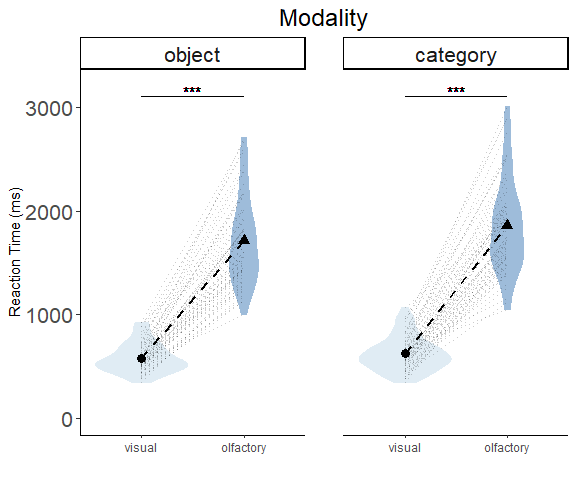<!-- --> *Effect of
modality on object-cue and category-cue response times.*

## Congruency

    ## png 
    ##   2

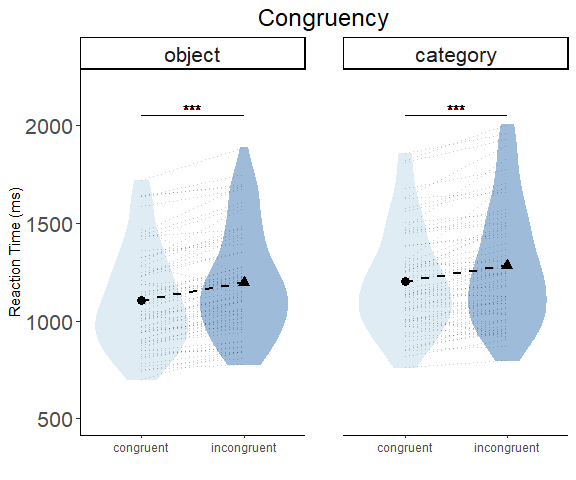<!-- --> *Effect of
congruency on object-cue and category-cue reaction times.*

## Interaction

``` r
# Plot dot graph containing interaction values.
png(path.expand("../results/interaction_bars.png"), width = 10, height = 6, units = 'in', res = 300)
interaction_bar_graph <- ggplot(diff_graph,
       aes(x = modality_c, y = incongruent_minus_congruent, fill = modality_c)) + 
  theme_classic() +
  geom_bar(stat = "identity", width = 0.5) +
 facet_wrap(~ cue_type_c, ncol = 2) +
 geom_errorbar(aes(ymin = incongruent_minus_congruent - se,
                   ymax = incongruent_minus_congruent + se),
               size = 1, width = .2, position = position_dodge(0.8)) +
  ggtitle("Interaction Bar Graph (with corrected standard error)") +
  xlab("Modality") + labs(fill = "Modality") + ylab("Incongruent - Congruent (ms)") +
  theme(plot.title = element_text(hjust = 0.5))

# Display graph on .png file.
interaction_bar_graph

# Exit graph.
dev.off()

# Plot graph.
interaction_bar_graph
```

    ## png 
    ##   2

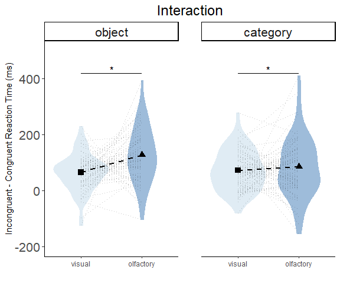<!-- --> *Difference
between incongruent and congruent reaction times (ms) for the object-cue
and category-cue conditions as a function of target modality.*

# Exploratory Analysis

Our main results showed that olfactory processing, similar to vision,
benefits from predictive cues, but this effect was exacerbated for
olfactory object cues. In an exploratory analyses, we asked how many
participants showed this pattern of priming? Unsurprisingly, congruent
targets were processed faster than incongruent targets in almost all
participants and conditions.

## Effect Of Congruency

    ## png 
    ##   2

<!-- -->
*Participant-level congruency effect. While fewer participants were
affected by the olfactory cue-target congruency manipulation relative to
the visual condition, this might be attributed to a higher task
difficulty in olfactory tasks, as the effect is clearly present for both
sensory modalities.*

# Participant Removal Criteria Based on Accuracy Performance

## Participant Removal Criteria

We finished the experiment with 69 participants tested. We had two
exclusion criteria based on either chance performance and olfactometer
issues.

  - 3 participants were removed for issues related to the olfactometer:
      - 109: Pear odor less potent. Teodor checked and confirmed it was
        fainter than the other odors.
      - 125: The lemon odor was too weak and the participant said they
        were having trouble detecting it.
      - 145: Lavender had lost all smell and participant had been tested
        with this odor absent.
  - 2 additional participant were removed fr low accuracy during odor
    blocks.

To remove participants at chance performace, an Adaptive Bayesian
Computation approach was taken. In short, a posterior parameter
distribution was computed using a binomial procedure. Each participant
was tested seperately and removed if their 95% credibility interval
included 50%. Each participant completed 48 trials per block type, and
the smallest disparity between correct and incorrect cue-target matches
that include 50% in the 95% credibility interval is 31/48 = \~ 65%. Any
participant below 31 out of 48 trials correct on a particicular block
was totally removed from the study (although their rating data was still
used). Additional logic for using this procedure: If I were to flip a
coin 48 times, and 24 out of 48 flips (50% ) came up heads, the
posterior probability estimate of the most probable weightings of heads
versus tails would be entered exactly at 50% (since a result like this
indicates the coin is perfectly fair). If instead I got slightly more
heads than tails (26 out of 48 = 54%) the posterior estimate would be
have its mode greater than 50%, but the 95% most probable weightings of
the coin still include 50% so we couldn’t conclude at 95% probability
that the coin is biased towards heads. Once you get to 31 out of 48%
heads (65%), the 95% most probable weightings of the coin no longer
contain 50% (which represents a fair coin), so all of the most probable
weightings that generated the observed data represent an unfair coin
biased towards heads. For the accuracy data, if 50% (guessing) is
included in the 95% most probable values generating the data, w can’t
rule out that the data were generated by someone who is guessing. If the
95% most probable values do not include 50%, thn based on the observed
data, we can conclude that the data were not generated by a person who
is guessing. Examples of posterior distributions on the next page.

### Adaptive Bayesian Computation Examples

#### Ex. 1

<!-- --> *Hypothetical
posterior distribution where a participants is guessing.*

#### Ex. 2

<!-- -->
*The lowest acceptable response profile threshold for accuracy (31/48
correct responses): any participant with a lower accuracy score than
that which produced this posterior distribution (i.e. response profile
\<= 30/48) was removed.*

#### Ex. 3

<!-- --> *A more
typical posterior distribution where participant accuracy is \~ 90%.*

# Accuracy By Reaction Time Correlation

## Regression Graphs

    ## png 
    ##   2

<!-- -->
*Evidence of a speed/accuracy trade-off? Difference in congruency
reaction time as a function of average participant accuracy for all
combinations of modality and cue type. Top right: While the correlation
is statistically significant, there is very strong visual evidence that
the negative slope is in fact driven by a single data point.*

## Outlier Follow-up

    ## png 
    ##   2

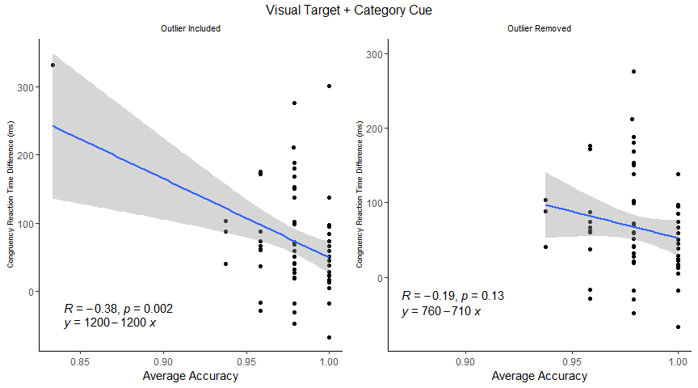<!-- -->
*Speed/accuracy trade-off is driven by a single data point. Removal of a
single participant eliminated the significant result.*

# Accuracy By Trial Number Correlation

## Regression Graphs

    ## png 
    ##   2

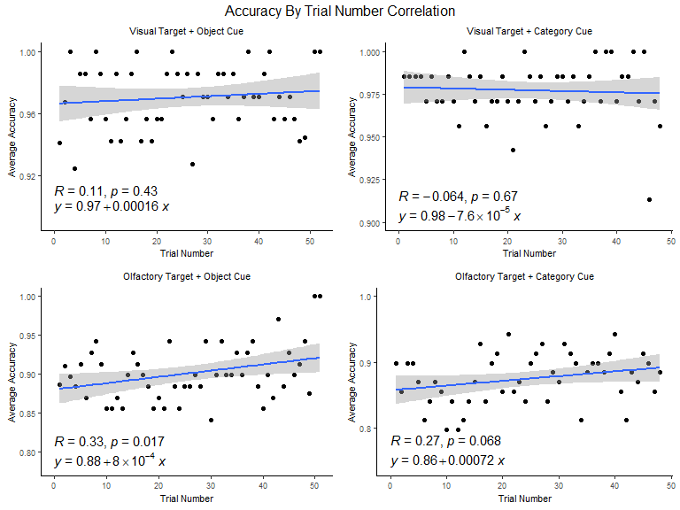<!-- --> *Participants
did not become more accurate in any condition over time.*

# Reaction Time by Trial Number Correlation

## Regression Graphs

    ## png 
    ##   2

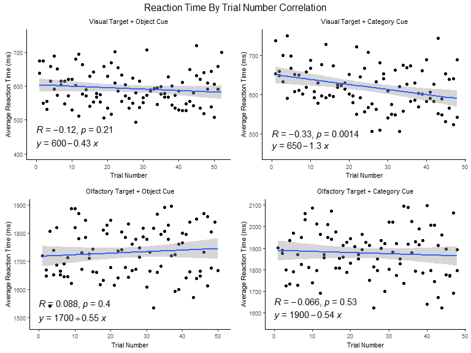<!-- -->
*Participants responded faster as visual and olfactory target conditions
progressed when cued by category-base cues.*

## Congruency Split

    ## png 
    ##   2

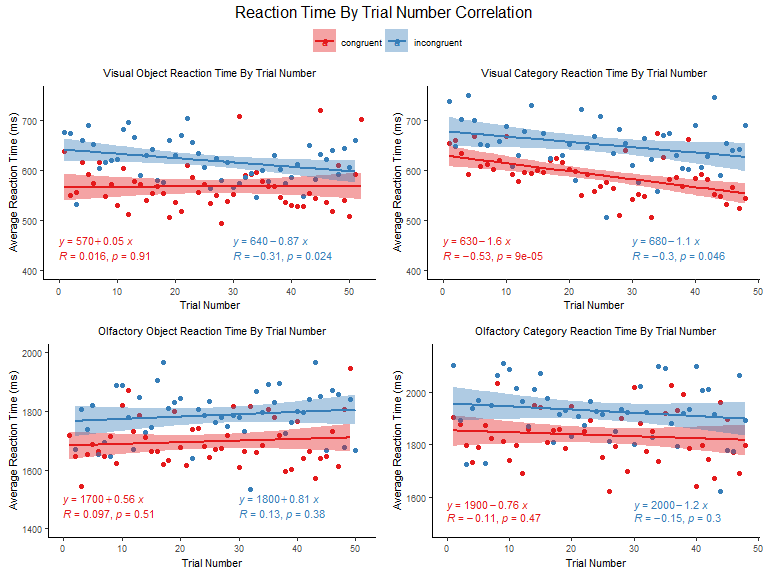<!-- --> *When
separated by congruency, participants showed a statistically significant
decrease in reaction time as a function of trial for both congruent and
incongruent category-cue/ visual target trials, and for incongruent
object-cue/visual target trials.*

# Simulation-Based Power For ANOVA

We attempted to simulate summary statistics for a dataset we might
expect to see from an experiment like ours. We used a simple 2 x 2
within-subjects design for both object-cue and category-cue simulations.
The design includes 69 participants, and reaction times we believe are
reasonable to assume: A very large effect of modality, a moderate effect
of congruency, and a small effect size for their interaction. We also
set each parameter to be highly correlated as a fully within-subjects
design will include only correlated measures. Of note, we the ANOVApower
package does not allow for different standard deviations per group.
Unfortunately, we expected far greater variability for olfactory versus
visual reaction times. But this is simply a limitation we have to be up
front about.

## Design

### 80% Power

``` r
design_result_80_power <- ANOVA_design(design = "2w*2w",
                                       n = 69, 
                                       mu = c(400, 1200, 430, 1400), 
                                       sd = 550, 
                                       r = c(0.8, 0.8, 0.8,
                                             0.8, 0.8,
                                             0.8),
                                       labelnames = c("congruency", "congruent", "incongruent",
                                                      "modality", "visual", "olfactory"))
```

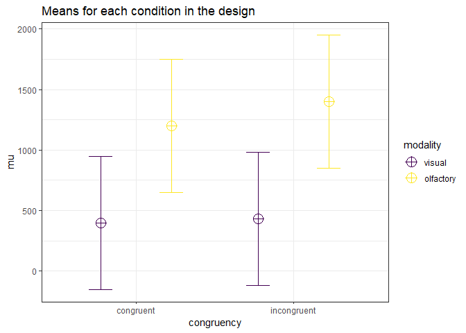<!-- -->

``` r
design_result_80_power_main <- ANOVA_exact(design_result_80_power)
```

``` r
design_result_80_power_main$plot
```

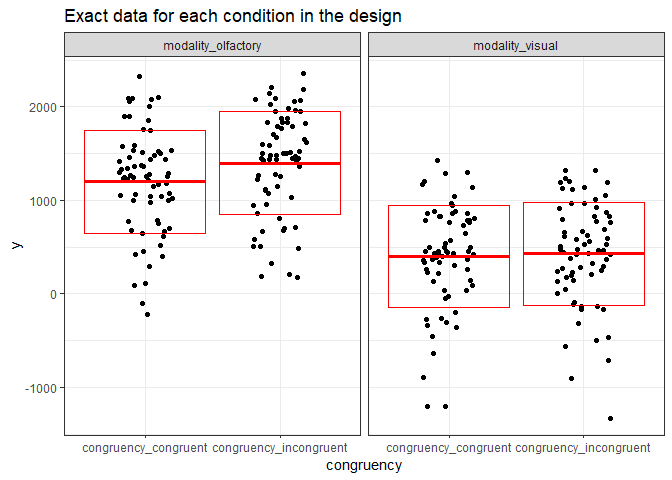<!-- --> *Design for
assessing effect size our study would have an 80% probability of
detecting*

``` r
design_result_80_power_main$main_results
```

    ##                         power partial_eta_squared   cohen_f non_centrality
    ## congruency           96.91411           0.1815419 0.4709667      15.083058
    ## modality            100.00000           0.9292599 3.6243962     893.264876
    ## congruency:modality  80.78041           0.1080807 0.3481059       8.240083

### Detect 0.1 Interaction

``` r
design_result_13_power <- ANOVA_design(design = "2w*2w",
                                       n = 69, 
                                       mu = c(400, 1200, 430, 1280), 
                                       sd = 550, 
                                       r = c(0.8, 0.8, 0.8,
                                             0.8, 0.8,
                                             0.8),
                                       labelnames = c("congruency", "congruent", "incongruent",
                                                      "modality", "visual", "olfactory"))
```

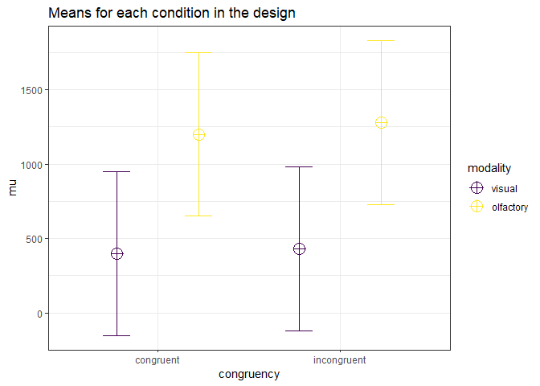<!-- -->

``` r
design_result_13_power_main <- ANOVA_exact(design_result_13_power)
```

``` r
design_result_13_power$plot
```

    ## NULL

*Design for assessing how much power the study had to detect a 0.1
interaction*

``` r
design_result_13_power$main_results
```

    ## NULL

## Power Analysis Results

### 80% Power

``` r
kbl(data.frame("parameter_80" = c("congruency", "modality", "congruency:modality"),
                       "power_80" = c(96.9141, 100.0000, 80.7804),
                       "partial_eta_squared_80" = c(0.1815, 0.9293, 0.1081),
                       "cohen_f_80" = c(0.4710, 3.6244, 0.3481),
                       "non_centrality_80" = c(15.0831, 893.2649, 8.2401)))
```

*Simulated Parameters for 80% Power to Detect Interaction*

    ## Achieved Power and Sample Size for ANOVA-level effects
    ##              variable                  label  n achieved_power desired_power
    ## 1          congruency Desired Power Achieved 38          80.14            80
    ## 2            modality Desired Power Achieved  5          99.99            80
    ## 3 congruency:modality Desired Power Achieved 68          80.20            80

    ## png 
    ##   2

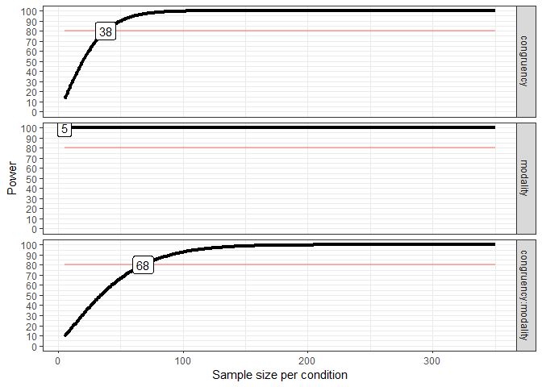<!-- -->

    ## Achieved Power and Sample Size for ANOVA-level effects
    ##              variable                  label  n achieved_power desired_power
    ## 1          congruency Desired Power Achieved 38          80.14            80
    ## 2            modality Desired Power Achieved  5          99.99            80
    ## 3 congruency:modality Desired Power Achieved 68          80.20            80

    ## png 
    ##   2

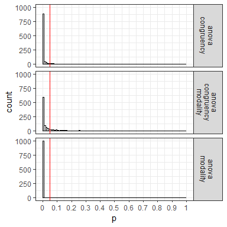<!-- -->

### 0.1 Power

``` r
kbl(data.frame("parameter_13" = c("congruency", "modality", "congruency:modality"),
               "power_13" = c(44.8835, 100.0000, 13.2369),
               "partial_eta_squared_13" = c(0.0483, 0.9195, 0.0104),
               "cohen_f_13" = c(0.2252, 3.3787, 0.1024),
               "non_centrality_13" = c(3.4500, 776.2500, 0.7128)))
```

*Simulated Parameters to detect 0.1 effect size for Interaction*

    ## Achieved Power and Sample Size for ANOVA-level effects
    ##              variable                  label   n achieved_power desired_power
    ## 1          congruency Desired Power Achieved 159          80.02            80
    ## 2            modality Desired Power Achieved   5          99.96            80
    ## 3 congruency:modality Desired Power Achieved 762          80.02            80

    ## png 
    ##   2

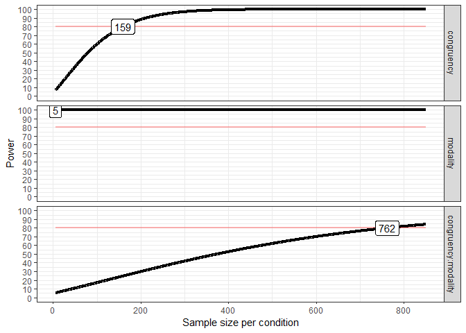<!-- -->

    ## Achieved Power and Sample Size for ANOVA-level effects
    ##              variable                  label   n achieved_power desired_power
    ## 1          congruency Desired Power Achieved 159          80.02            80
    ## 2            modality Desired Power Achieved   5          99.96            80
    ## 3 congruency:modality Desired Power Achieved 762          80.02            80

    ## png 
    ##   2

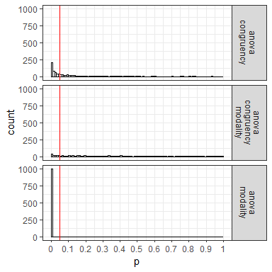<!-- -->
